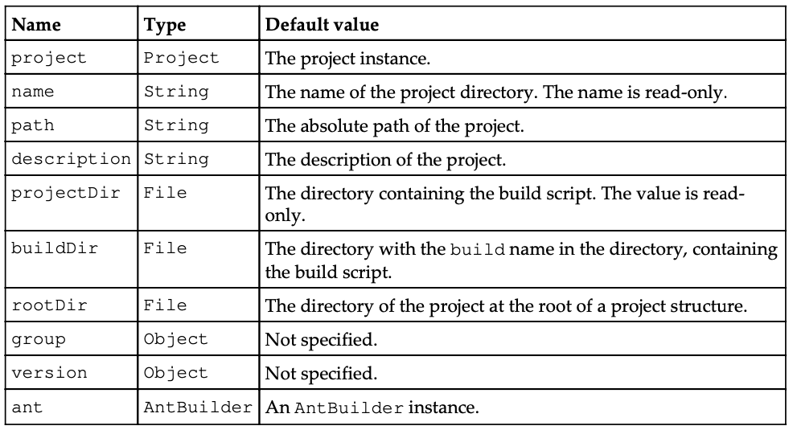
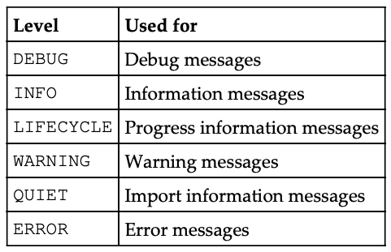
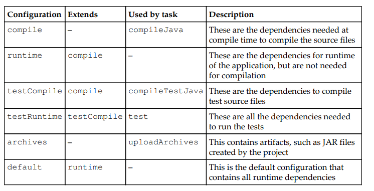
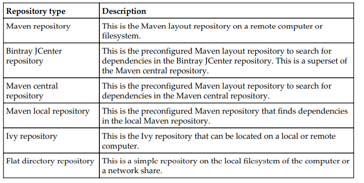
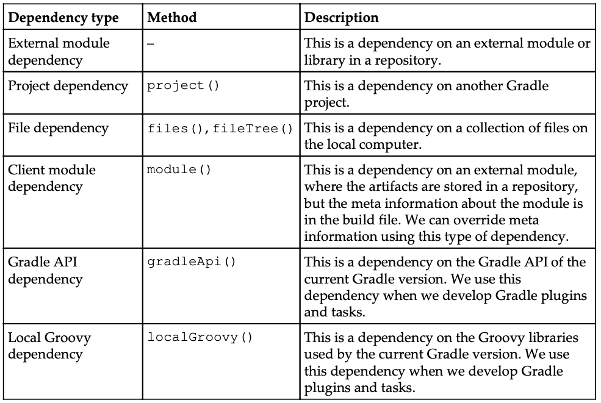
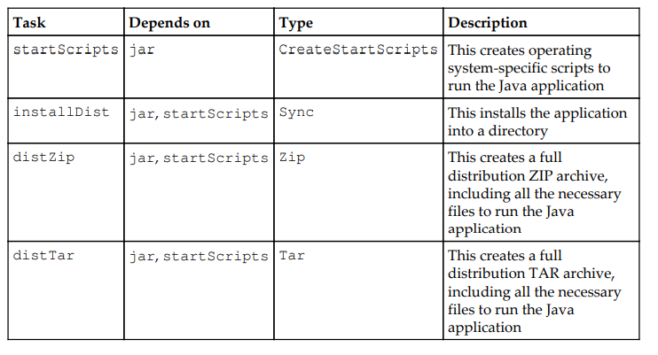

# Chapter 1. Starting with Gradle

When we develop a software, we write, compile, test, package, and finally, distribute the code.

Gradle is flexible, but has sensible defaults for most projects. This means that we can rely on the defaults if we don't want something special, but we can still can use the flexibility to adapt a build to certain custom needs.

## Declarative builds and convention over configuration

Gradle uses a Domain Specific Language (DSL) based on Groovy to declare builds. The DSL provides a flexible language that can be extended by us. As the DSL is based on Groovy, we can write Groovy code to describe a build and use the power and expressiveness of the Groovy language.

Gradle is designed to be a build language and not a rigid framework. The Gradle core itself is written in Java and Groovy. To extend Gradle, we can use Java and Groovy to write our custom code.

## Incremental builds

With Gradle, we have incremental builds. This means the tasks in a build are only executed if necessary. For example, a task to compile source code will first check whether the sources have changed since the last execution of the task. If the sources have changed, the task is executed; but if the sources haven't changed, the execution of the task is skipped and the task is marked as being up to date.

## Multi-project builds

Gradle has great support for multi-project builds. A project can simply be dependent on other projects or be a dependency of other projects. We can define a graph of dependencies among projects, and Gradle can resolve these dependencies for us.

Gradle has support for partial builds. This means that Gradle will figure out whether a project, which our project depends on, needs to be rebuild or not. If the project needs rebuilding, Gradle will do this before building our own project.

## Gradle Wrapper

The **Gradle Wrapper** allows us to execute Gradle builds even if Gradle is not installed on a computer. This is a great way to distribute source code and provide the build system with it so that the source code can be built.

## Getting started

Although Gradle uses Groovy, we don't have to install Groovy ourselves. **Gradle bundles the Groovy libraries with the distribution and will ignore a Groovy installation that is already available on our computer.**

**At the time of writing this book, the current release is 2.12.**

*My note.*
I'll try to run with Gradle 7.0 and fix possible mismatches.

### Installing Gradle

Just follow the manual in webpage.

### Writing our first build script

Gradle uses the concept of **projects to define a related set of tasks**. A Gradle **build can have one or more projects**. A **project** is a very broad concept in Gradle, but it is mostly a **set of components that we want to build for our application**.

A **project has one or more tasks**. **Tasks** are a unit of work that need to be executed by the build. Examples of tasks are compiling source code, packaging class files into a JAR file, running tests, and deploying the application.

We now know a task is a part of a project, so to create our first task, we also create our first Gradle project. We use the ``gradle`` command to run a build. Gradle will look for a file named ``build.gradle`` in the current directory. **This file is the build script for our project.** We define our tasks that need to be executed in this build script file.

We create a new ``build.gradle`` file and open this in a text editor. We type the following code to define our first Gradle task:

```groovy
task helloWorld << {
    println 'Hello world.'
}
```

With this code, we will define a helloWorld task. The task will print the words Hello world. to the console. The println is a Groovy method to print text to the console and is basically a shorthand version of the System.out.println Java method.

The code between the brackets is a **closure**. A closure is a code block that **can be assigned to a variable or passed to a method.** Java doesn't support closures, but Groovy does. As Gradle uses Groovy to define the build scripts, we can use closures in our build scripts.

The ``<<`` syntax is, technically speaking, an operator shorthand for the ``leftShift()`` method, which actually means **add to**. Therefore, here we are defining that we want to add the closure (with the println 'Hello world' statement) to our task with the helloWorld name.

First, we save ``build.gradle``, and with the gradle helloWorld command, we execute our build:

*Note.*

<< was deprecated in Gradle 4.x and removed in Gradle 5.0. Use the ``Task.doLast()`` method instead, like this:
```groovy
task helloWorld {
    doLast {
        println 'Hello world.'
    }
}
```

```shell
$ gradle helloWorld

> Task :helloWorld
Hello world.

BUILD SUCCESSFUL in 9s
1 actionable task: 1 executed
```

The first line of output shows our line Hello world. Gradle adds some more output such as the fact that the build was successful and the total time of the build. As Gradle runs in the JVM, every time we run a Gradle build, the JVM must be also started. We can use the Gradle daemon to run our builds. We will discuss more about the Gradle daemon later, but it essentially keeps Gradle running in memory so that we don't get the penalty of starting the JVM each time we run Gradle.

We can run the same build again, but only with the output of our task using the Gradle ``-quiet`` or ``-q`` command-line option.

```shell
$ gradle -q helloWorld
Hello world.
```

## Default Gradle tasks

Gradle has several built-in tasks that we can execute. We type ``gradle -q tasks`` to see the tasks for our project:

```shell
$ gradle -q tasks

------------------------------------------------------------
All tasks runnable from root project
------------------------------------------------------------
Build Setup tasks
-----------------
init - Initializes a new Gradle build. [incubating]
wrapper - Generates Gradle wrapper files. [incubating]
Help tasks
----------
components - Displays the components produced by root project
'hello-world'. [incubating]
dependencies - Displays all dependencies declared in root project 'helloworld'.
dependencyInsight - Displays the insight into a specific n dependency
in root project 'hello-world'.
help - Displays a help message.
model - Displays the configuration model of root project 'hello-world'.
[incubating]
projects - Displays the sub-projects of root project 'hello-world'.
properties - Displays the properties of root project 'hello-world'.
tasks - Displays the tasks runnable from root project 'hello-world'.
Other tasks
-----------
helloWorld
To see all tasks and more detail, run gradle tasks --all
To see more detail about a task, run gradle help --task <task>
```

However, if I run with Gradle 7.0, I do not get helloWorld listed. I need to use ``--all`` flag:
```shell
$ gradle -q tasks --all

------------------------------------------------------------
Tasks runnable from root project 'GradleStuff'
------------------------------------------------------------

Build Setup tasks
-----------------
init - Initializes a new Gradle build.
wrapper - Generates Gradle wrapper files.

Help tasks
----------
buildEnvironment - Displays all buildscript dependencies declared in root project 'GradleStuff'.
dependencies - Displays all dependencies declared in root project 'GradleStuff'.
dependencyInsight - Displays the insight into a specific dependency in root project 'GradleStuff'.
help - Displays a help message.
javaToolchains - Displays the detected java toolchains.
outgoingVariants - Displays the outgoing variants of root project 'GradleStuff'.
projects - Displays the sub-projects of root project 'GradleStuff'.
properties - Displays the properties of root project 'GradleStuff'.
tasks - Displays the tasks runnable from root project 'GradleStuff'.

Other tasks
-----------
components - Displays the components produced by root project 'GradleStuff'. [deprecated]
dependentComponents - Displays the dependent components of components in root project 'GradleStuff'. [deprecated]
helloWorld
model - Displays the configuration model of root project 'GradleStuff'. [deprecated]
prepareKotlinBuildScriptModel
```

Here, we see our helloWorld task in the Other tasks section. The Gradle built-in tasks are displayed in the Help tasks section.

```shell
$ gradle -q help

Welcome to Gradle 7.0.2.

To run a build, run gradle <task> ...

To see a list of available tasks, run gradle tasks

To see a list of command-line options, run gradle --help

To see more detail about a task, run gradle help --task <task>
```

The properties task is very useful to see the properties available for our project. We haven't defined any property ourselves in the build script, but Gradle provides a lot of built-in properties. The following output shows some of the properties:

```shell
$ gradle -q properties

------------------------------------------------------------
Root project 'GradleStuff'
------------------------------------------------------------

allprojects: [root project 'GradleStuff']
ant: org.gradle.api.internal.project.DefaultAntBuilder@438e89bf
antBuilderFactory: org.gradle.api.internal.project.DefaultAntBuilderFactory@76798b57
artifacts: org.gradle.api.internal.artifacts.dsl.DefaultArtifactHandler_Decorated@8f5f071
asDynamicObject: DynamicObject for root project 'GradleStuff'
baseClassLoaderScope: org.gradle.api.internal.initialization.DefaultClassLoaderScope@5ca5de95
buildDir: C:\Users\BC6250\Desktop\GradleStuff\build
buildFile: C:\Users\BC6250\Desktop\GradleStuff\build.gradle
buildPath: :
buildScriptSource: org.gradle.groovy.scripts.TextResourceScriptSource@6bd177cf
buildscript: org.gradle.api.internal.initialization.DefaultScriptHandler@51c86ad1
childProjects: {}
class: class org.gradle.api.internal.project.DefaultProject_Decorated
...
```

The dependencies task will show dependencies (if any) for our project. Our first project doesn't have any dependencies, as the output shows when we run the task:

```shell
gradle -q dependencies

------------------------------------------------------------
Root project 'GradleStuff'
------------------------------------------------------------

No configurations
```

The projects tasks will display subprojects (if any) for a root project. Our project doesn't have any subprojects. Therefore, when we run the projects task, the output shows us our project has no subprojects:

```shell
$ gradle -q projects

------------------------------------------------------------
Root project 'GradleStuff'
------------------------------------------------------------

Root project 'GradleStuff'
No sub-projects
```

The model tasks displays information about the model that Gradle builds internally from our project build file.

```shell
$ gradle -q model

------------------------------------------------------------
Root project 'GradleStuff'
------------------------------------------------------------

+ tasks
      | Type:           org.gradle.model.ModelMap<org.gradle.api.Task>
      | Creator:        Project.<init>.tasks()
    + buildEnvironment
          | Type:       org.gradle.api.tasks.diagnostics.BuildEnvironmentReportTask
          | Value:      task ':buildEnvironment'
          | Creator:    Project.<init>.tasks.buildEnvironment()
          | Rules:
             ? copyToTaskContainer
    + components
          | Type:       org.gradle.api.reporting.components.ComponentReport
          | Value:      task ':components'
          | Creator:    Project.<init>.tasks.components()
          | Rules:
             ? copyToTaskContainer
...
```

## Task name abbreviation

Before we look at more Gradle command-line options, it is good to discuss a real-time save feature of Gradle: task name abbreviation. With task name abbreviation, we don't have to type the complete task name on the command line. We only have to type enough of the name to make it unique within the build.

In our first build, we only have one task, so the ``gradle h`` command should work just fine. However, we didn't take the built-in ``help`` task into account. So, to uniquely identify our ``helloWorld`` task, we use the ``hello`` abbreviation:

```shell
$ gradle -q hello
Hello world.
```

```shell
$ gradle -q hW
Hello world.
```

## Executing multiple tasks

With just a simple build script, we already discussed that we have a couple of default tasks besides our own task that we can execute. To execute multiple tasks, we only have to add each task name to the command line. Let's execute our ``helloWorld`` custom task and builtin ``tasks`` task:

```shell
gradle hello tasks
Hello world.ojects CONFIGURING [46ms]

> Task :tasks

------------------------------------------------------------
Tasks runnable from root project 'GradleStuff'
------------------------------------------------------------

Build Setup tasks
-----------------
init - Initializes a new Gradle build.
wrapper - Generates Gradle wrapper files.

Help tasks
----------
buildEnvironment - Displays all buildscript dependencies declared in root project 'GradleStuff'.
dependencies - Displays all dependencies declared in root project 'GradleStuff'.
dependencyInsight - Displays the insight into a specific dependency in root project 'GradleStuff'.
help - Displays a help message.
javaToolchains - Displays the detected java toolchains.
outgoingVariants - Displays the outgoing variants of root project 'GradleStuff'.
projects - Displays the sub-projects of root project 'GradleStuff'.
properties - Displays the properties of root project 'GradleStuff'.
tasks - Displays the tasks runnable from root project 'GradleStuff'.
```

Gradle executes the tasks in the same order as they are defined in the command line. **Gradle will only execute a task once during the build.** So even if we define the same task multiple times, it will only be executed once.

## Command-line options

The ``gradle`` command is used to execute a build. This command accepts several commandline options. We know the ``--quiet`` (or ``-q``) option to reduce the output of a build. If we use the ``--help`` (or ``-h`` or ``-?``) option, we see the complete list of options

## Logging options

Let's look at some of the options in more detail. The ``--quiet`` (or ``-q``), ``--debug`` (or ``-d``), ``--info`` (or ``-i``), ``--stacktrace`` (or ``-s``), and ``--full-stacktrace`` (or ``-S``) options control how much output we see when we execute tasks. To get the most detailed output, we use the ``--debug`` (or ``-d``) option. This option provides a lot of output with information about the steps and classes used to run the build.

**To get a better insight on the steps that are executed for our task, we can use the ``--info`` (or ``-i``) option.** The output is not as verbose as with ``--debug``, but it can provide a better understanding of the build steps:

```shell
$ gradle --info helloWorld
Initialized native services in: C:\Users\BC6250\.gradle\native
The client will now receive all logging from the daemon (pid: 22132). The daemon log file: C:\Users\BC6250\.gradle\daemon\7.0.2\daemon-22132.out.log
Starting 20th build in daemon [uptime: 33 mins 21.262 secs, performance: 100%, non-heap usage: 21% of 256 MiB]
Using 8 worker leases.
Now considering [C:\Users\BC6250\Desktop\GradleStuff] as hierarchies to watch
Not watching anything anymore
Watching the file system is enabled if available
Starting Build
Settings evaluated using settings file 'C:\Users\BC6250\Desktop\GradleStuff\settings.gradle'.
Projects loaded. Root project using build file 'C:\Users\BC6250\Desktop\GradleStuff\build.gradle'.
Included projects: [root project 'GradleStuff']

> Configure project :
Evaluating root project 'GradleStuff' using build file 'C:\Users\BC6250\Desktop\GradleStuff\build.gradle'.
All projects evaluated.
Selected primary task 'helloWorld' from project :
Tasks to be executed: [task ':helloWorld']
Tasks that were excluded: []
:helloWorld (Thread[Execution worker for ':',5,main]) started.

> Task :helloWorld
Caching disabled for task ':helloWorld' because:
  Build cache is disabled
Task ':helloWorld' is not up-to-date because:
  Task has not declared any outputs despite executing actions.
Hello world.
:helloWorld (Thread[Execution worker for ':',5,main]) completed. Took 0.014 secs.
```

If our build throws exceptions, we can see the stack trace information with the ``--stacktrace`` (or ``-s``) and ``--full-stacktrace`` (or ``-S``) options. The latter option will output the most information and is the most verbose. The ``--stacktrace`` and ``--fullstacktrace`` options can be combined with the other logging options.

## Changing the build file and directory

We created our build file with the ``build.gradle`` name. This is the default name for a build file. Gradle will look for a file with this name in the current directory to execute the build. However, we can change this with the ``--build-file`` (or ``-b``) and ``--project-dir`` (or ``-p``) command-line options.

## Running tasks without execution

With the ``--dry-run`` (or ``-m``) option, we can run all tasks without really executing them. When we use the dry-run option, we can see the tasks that are executed, so we get an insight on the tasks that are involved in a certain build scenario. We don't even have to worry whether the tasks are actually executed. Gradle builds up a **Directed Acyclic Graph** (DAG) with all tasks before any task is executed.
```shell
$ gradle -m hello 
:helloWorld 

SKIPPED  BUILD SUCCESSFUL in 8s
```

## Gradle daemon

We already discussed that Gradle executes in a JVM, and each time we invoke the gradle command, a new JVM is started, the Gradle classes and libraries are loaded, and the build is executed. We can reduce the build execution time if we don't have to load JVM and Gradle classes and libraries each time we execute a build. The ``--daemon`` command-line option starts a new Java process that will have all Gradle classes and libraries already loaded and then execute the build. Next time when we run Gradle with the ``--daemon`` option, only the build is executed as the JVM with the required Gradle classes and libraries is already running.

**The first time we execute Gradle with the --daemon option, the execution speed will not have improved as the Java background process was not started yet.** However, the next time, we can see a major improvement:

```shell

$ gradle --daemon helloWorld
Starting a new Gradle Daemon for this build (subsequent builds will be faster).
:helloWorld
Hello world.
BUILD SUCCESSFUL
Total time: 2.136 secs

$ gradle helloWorld
:helloWorld
Hello world.
BUILD SUCCESSFUL
Total time: 0.594 secs
```

Even though the daemon process is started, we can still run Gradle tasks without using the daemon. We use the --no-daemon command-line option to run a Gradle build, and then the daemon is not used:

```shell
$ gradle --no-daemon helloWorld
```

To stop the daemon process, we use the ``--stop`` command-line option:

```shell
$ gradle --stop
Stopping daemon(s).
Gradle daemon stopped.
```

To always use the --daemon command-line option, but we don't want to type it every time we run the gradle command, we can
* create an alias ```$ alias gradled='gradle --daemon'```
* Instead of using the --daemon command-line option, we can use the org.gradle.daemon Java system property to enable the daemon. ```$ export GRADLE_OPTS="-Dorg.gradle.daemon=true"```
* Finally, we can add a ``gradle.properties`` file to the root of our project directory. ``gradle.properties`` content: ```org.gradle.daemon=true```

## Profiling

Gradle also provides the ``--profile`` command-line option. This option records the time that certain tasks take to complete. The data is saved in an HTML file in the ``build/reports/profile`` directory.

## Offline usage

If we don't have access to a network at some location, we might get errors from our Gradle build, when a task needs to download something from the Internet, for example. We can use the ``--offline`` command-line option to instruct Gradle to not access any network during the build. This way we can still execute the build if all necessary files are already available offline and we don't get an error.

## Understanding the Gradle graphical user interface

*Note.*

The Gradle GUI has been deprecated and will be removed in Gradle 4.0.

# Chapter 2. Creating Gradle Build Scripts

In Gradle, projects and tasks are two important concepts. **A Gradle build always consists of one or more projects. A project defines some sort of component that we want to build.** There are no defining rules about what the component is. It can be a JAR file with utility classes to be used in other projects, or a web application to be deployed to the corporate intranet. A project doesn't have to be about building and packaging code, it can also be about doing things such as copying files on a remote server or deployment of applications to servers.

**A project has one or more tasks. A task is a small piece of work that is executed when we run a build**, for example, compiling source code, packaging code in an archive file, generating documentation, and so on.

## Writing a build script

```groovy
project.description = 'Simple project'

task simple {
    doLast {
        println 'Running simple task for project ' + project.description
    }
}
```

```shell
gradle simple -q
Running simple task for project Simple project
```

A couple of interesting things happen with this small build script. Gradle reads the script file and creates a Project object. The build script configures the Project object, and finally, the set of tasks to be executed is determined and executed.

So, it is important to note that Gradle creates a Project object for us. The Project object has several properties and methods and it is available in our build scripts. We can use the project variable name to reference the Project object, but we can also leave out this variable name to reference properties and methods of the Project object.

We used the explicit project variable name and Groovy property assignment syntax. The following build script uses a different syntax, which is a bit more like Java, to get the same result

```groovy
project.setDescription('Simple project')

project.getTasks().create('simple') {
    println 'Running simple task for project ' + project.description
}
```

Here, we use the Java syntax to set and get the value of the description property of the Project object.

## Defining tasks

A project has one or more tasks to execute some actions, so a task is made up of actions. These actions are executed when the task is executed. **Gradle supports several ways to add actions to our tasks.** In this section, we discuss about the different ways to add actions to a task.

We can use the ``doFirst`` and ``doLast`` methods to add actions to our task.

```groovy
task first {
    doFirst {
        println 'Running first'
    }
}
task second {
    doLast { Task task ->
        println "Running ${task.name}"
    }
}
```

```shell
$ gradle first second
Starting a Gradle Daemon (subsequent builds will be faster)

> Task :first
Running first

> Task :second
Running second
```

For the second task, we add the action to print text with the doLast method. The method accepts a closure as an argument. The task object is passed to the closure as a parameter. This means that we can use the task object in our actions. In the sample build file, we get the value for the name property of task and print it to the console.

Maybe it is a good time to look more closely at closures as they are an important part of Groovy and are used throughout Gradle build scripts. **Closures** are basically reusable pieces of code that **can be assigned to a variable or passed to a method**. A closure is defined by enclosing the piece of code with curly brackets ``({... })``. We can **pass one or more parameters to the closures**. **If the closure has only one argument, an implicit parameter, ``it``, can be used to reference the parameter value.** We could have written the second task as follows, and the result would still be the same:

```groovy
task second {
    doLast {
    // Using implicit 'it' closure parameter. The type of 'it' is a Gradle task.
        println "Running ${it.name}"
    }
}
```

We can also define a name for the parameter and use this name in the code. This is what we did for the second task.

```groovy
task second {
    doLast { Task task ->
        // Using explicit name 'task' as closure parameter.
        // We also defined the type of the parameter.
        // This can help the IDE to add code completion.
        println "Running ${task.name}"
    }
}
```

## Defining actions with the Action interface

Besides using closures to add actions to a task, we can also follows a more verbose way of passing an implementation class of the ``org.gradle.api.Action`` interface. The Action interface has one method: execute. This method is invoked when the task is executed.

```groovy
task first {
    doFirst(
            new Action() {
                void execute(O task) {
                    println "Running ${task.name}"
                }
            }
    )
}
```
*Note.*
Does not work. However, if I add generic type, then it works:
```groovy
task first {
    doFirst(
            new Action<Task>() {
                void execute(Task task) {
                    println "Running ${task.name}"
                }
            }
    )
}
```

## Build scripts are Groovy code

We already saw the use of so-called Groovy ``GString`` in our sample script. The ``GString`` object is defined as a String with double quotes and can contain references to variables defined in a ``${... }`` section. The variable reference is resolved when we get the value of the ``GString``.

However, other great Groovy constructs can also be used in Gradle scripts. The following sample script shows some of these constructs:

```groovy
task numbers {
    doLast {
        (1..4).each { number ->
            def squared = number * number;
            println "Square of ${number} = ${squared}"
        }
    }
}

task list {
    doFirst {
        def list = ['Groovy', 'Gradle']
        println list.collect { it.toLowerCase() }.join('&')
    }
}
```

## Defining dependencies between tasks

Until now, we have defined tasks independent of each other. However, in our projects, we need dependencies between tasks. For example, a task to package compiled class files is dependent on the task to compile the class files. The build system should then run the compile task first, and when the task is finished, the package task must be executed.

In Gradle, we can add task dependencies with the dependsOn method for a task. **We can specify a task name as the String value or task object as the argument.** We can even specify more than one task name or object to specify multiple task dependencies.

```groovy
task first {
    doLast { task ->
        println "Run ${task.name}"
    }
}

task second {
    doLast { task ->
        println "Run ${task.name}"
    }
}

second.dependsOn 'first'
```

```shell
$ gradle -q second
Run first
Run second
```

Note that we define the dependency of the second task on the first task, in the last line. When we run the script, we see that the first task is executed before the second task.

Another way of defining the dependency between tasks is to set the ``dependsOn`` property instead of using the ``dependsOn`` method. There is a subtle difference, Gradle just offers several ways to achieve the same result. In the following piece of code, we use the property to define the dependency of the second task. For the third task, we immediately define the property when we define the task:

```groovy
task first {
    doLast { task ->
        println "Run ${task.name}"
    }
}

task second {
    doLast { task ->
        println "Run ${task.name}"
    }
}

second.dependsOn = ['first']

task third (dependsOn: 'second') {
    doLast{ task ->
        println "Run ${task.name}"
    }
}
```

```shell
$ gradle -q third

Run first
Run second
Run third
```

The dependency between tasks is lazy. We can define a dependency on a task that is defined later in the build script. Gradle will set up all task dependencies during the configuration phase and not during the execution phase.

It is important to take a good look at your build scripts and see if things can be organized better and if the code can be reused instead of repeated. Even our simple build script can be rewritten as follows:

```groovy
def printTaskName = { task -> println "Run ${task.name}"}

// We use the variable with the closure.
task third(dependsOn: 'second') << printTaskName
task second(dependsOn: 'first') << printTaskName
task first << printTaskName
```

*Note.*

Because ``<<`` is not supported anymore, one should do like so:
```groovy
def printTaskName = { task -> println "Run ${task.name}" }

task first {
    doLast printTaskName
}

task second {
    doLast printTaskName
}

second.dependsOn = ['first']

task third(dependsOn: 'second') {
    doLast printTaskName
}
```

```groovy
def printTaskName = { task -> println "Run ${task.name}" }

task third {
    doLast (
            new Action<Task>() {
                void execute(Task task) {
                    printTaskName.call(task)
                }
            }
    )
}
```

## Defining dependencies via tasks

In our build scripts, we defined the task dependencies using the task name. However, there are more ways to define a task dependency. We can use the task object instead of the task name to define a task dependency:

```groovy
def printTaskName = { task -> println "Run ${task.name}"}

task first {
    doLast printTaskName
}

// Here we use first (not the string value 'first') as a value for dependsOn.
task second(dependsOn: first) {doLast printTaskName}
```

## Defining dependencies via closures

We can also use a closure to define the task dependencies. The closure must return a single task name or object, or a collection of task names or task objects. Using this technique, we can really fine-tune the dependencies for our task. For example, in the following build script, we define a dependency for the second task on all tasks in the project with task names that have the letter f in the task name:

```groovy
def printTaskName = { task -> println "Run ${task.name}"}

task second {
    doLast printTaskName
}

second.dependsOn {
    project.tasks.findAll { task ->
        task.name.contains 'f'
    }
}

task first {
    doLast printTaskName
}

task beforeSecond {
    doLast printTaskName
}
```

## Setting default tasks

To execute a task, we use the task name on the command line when we run gradle. So, if our build script contains a task with the first name, we can run the task with the following command:

```shell
$ gradle first
```

However, we can also define a default task or multiple default tasks that need to be executed, even if we don't explicitly set the task name. So, **if we run the gradle command without arguments, the default task of our build script will be executed.**

To set the default task or tasks, we use the defaultTasks method. We pass the names of the tasks that need to be executed to the method. In the following build script, we make the first and second tasks the default tasks:

```groovy
defaultTasks 'first', 'second'

task first {
    doLast {
        println "I am first"
    }
}
task second {
    doFirst {
        println "I am second"
    }
}
```

```shell
$ gradle

> Task :first
I am first

> Task :second
I am second
```

## Organizing tasks

In Chapter 1, Starting with Gradle, we already discussed that we could use the tasks task of Gradle to see the tasks that are available for a build. Let's suppose we have the following simple build script:

```groovy
defaultTasks 'second'

task first {
    doLast {
        println "I am first"
    }
}

task second(dependsOn: first) {
    doLast {
        println "I am second"
    }
}
```

When we run the tasks task on the command line, we get the following output:

```shell
$ gradle -q tasks
------------------------------------------------------------
All tasks runnable from root project
------------------------------------------------------------
Default tasks: second
Build Setup tasks
-----------------
init - Initializes a new Gradle build. [incubating]
wrapper - Generates Gradle wrapper files. [incubating]
Help tasks
----------
components - Displays the components produced by root project 'organize'.
[incubating]
dependencies - Displays all dependencies declared in root project
'organize'.
dependencyInsight - Displays the insight into a specific dependency in
root project 'organize'.
help - Displays a help message.
model - Displays the configuration model of root project 'organize'.
[incubating]
projects - Displays the sub-projects of root project 'organize'.
properties - Displays the properties of root project 'organize'.
tasks - Displays the tasks runnable from root project 'organize'.
Other tasks
-----------
second
To see all tasks and more detail, run gradle tasks --all
To see more detail about a task, run gradle help --task <task>
```

We see our task with the name second in the section Other tasks, but not the task with the name first. To see all tasks, including the tasks other tasks depend on, we must add the option --all to the tasks command:

```shell
$ gradle tasks --all
...
Other tasks
-----------
second
  first
```

*Note.*

I do not observe any of this. My tasks are only visible with added --all flag. If no flag, then none of the tasks are visible. Also, no indentation. 

## Adding a description to tasks

To describe our task, we can set the description property of a task. The value of the description property is used by the task of Gradle. Let's add a description to our two tasks, as follows:

```groovy
defaultTasks 'second'

// Use description property to set description.
task first(description: 'Base task') {
    doLast {
        println "I am first"
    }
}
task second(
        dependsOn: first,
        description: 'Secondary task') {
    doLast {
        println "I am second"
    }
}
```

```shell
$ gradle tasks --all

...
first - Base task
second - Secondary task
```

## Grouping tasks together

With Gradle, we can also group tasks together in so-called **task groups**. A **task group is a set of tasks that belong together, logically.** The task group is used, for example, in the output of the tasks task that we used earlier. Let's expand our sample build script by grouping the two tasks together in a sample task group.

```groovy
defaultTasks 'second'

// Define name of the task group we want to use
def taskGroup = 'base'

task first (
        description: 'Base task',
        group: taskGroup) {
    doLast {
        println 'I am first'
    }
}

task second (
        dependsOn: first,
        description: 'Secondary task',
        group: taskGroup) {
    doLast {
        println 'I am second'
    }
}
```

Next time when we run the tasks task, we can see our tasks grouped together in a Base tasks section:
```shell
$ gradle -q tasks

------------------------------------------------------------
Tasks runnable from root project 'GradleStuff'
------------------------------------------------------------

Default tasks: second

Base tasks
----------
first - Base task
second - Secondary task
...
```

## Getting more information about a task

Getting more information about a task We can get some more information about a task with the Gradle ``help`` task. We need to specify an extra argument for the ``help`` task: ``--task``, with the name of the task that we want more information about. Gradle will print some details about our task in the console.

```shell
$ gradle help --task second

> Task :help
Detailed task information for second

Path
     :second

Type
     Task (org.gradle.api.Task)

Description
     Secondary task

Group
     base
```

## Adding tasks in other ways

Until now, we have added tasks to our build project using the task keyword, followed by the name of the task. However, there are more ways to add tasks to our project. We can use a String value with the task name to define a new task, as follows:

```groovy
task 'simple' {
    doLast {
        task ->
            println "Running ${task.name}"
    }
}
```

```groovy
def simpleTask = 'simple'

task (simpleTask) {
    doLast {
        task ->
            println "Running ${task.name}"
    }
}
```

```groovy
def simpleTask = 'simple'

task "${simpleTask}" {
    doLast {
        task ->
            println "Running ${task.name}"
    }
}

['Dev', 'Acc', 'Prod'].each {environment ->
    task "deployTo${environment}" {
        doLast { task ->
            println "Deploying to ${environment}"
        }
    }
}
```

```shell
$ gradle -q tasks --all

...
Other tasks
-----------
deployToAcc
deployToDev
deployToProd
...
```

Another way to add a new task is through the ``tasks`` property of a project. Remember that in our build script, we have access to the ``Project`` object; either we use the project variable explicitly or we use methods and properties of the Project object implicitly, without using the project variable. The tasks property of a project is basically a container for all tasks in our project.

```groovy
def printTaskName = { task ->
    println "Running ${task.name}"
}
// Use tasks project variable to get access
// to the TaskContainer object.
// Then we use the create method of
// TaskContainer to create a new task.
project.tasks.create(name: 'first') << printTaskName
// Let Gradle resolve tasks to project variable.
tasks.create(name: 'second', dependsOn: 'first') << printTaskName
```

## Using task rules

We have seen how to add tasks dynamically to our build project. However, we can also define so-called **task rules**. These rules are very flexible and allow us to add tasks to our project based on several parameters and project properties.

Suppose, we want to add an extra task that shows the description of every task in our project. If we have a task first in our project, we want to add a descFirst task to show the description property of the first task. With task rules, we define a pattern for new tasks. In our sample, this is desc<TaskName>; it is the desc prefix, followed by the name of the existing task. The following build script shows the implementation of the task rule:

```groovy
task first(description: 'First task')

task second(description: 'Second task')

tasks.addRule("Pattern: desc<TaskName>: show description of a task.") { taskName ->
    if (taskName.startsWith('desc')) {
        // Remove 'desc' from the task name.
        def targetTaskName = taskName - 'desc'
        // Uncapitalize the task name.
        def targetTaskNameUncapitalize = targetTaskName[0].toLowerCase() + targetTaskName[1..-1]
        // Find the task in the project we search the description for.
        def targetTask = project.tasks.findByName(targetTaskNameUncapitalize)
        if (targetTask) {
            task(taskName) {
                doLast {
                    println "Description of task ${targetTask.name} -> ${targetTask.description}"
                }
            }
        }
    }
}
```

```shell
$ gradle tasks

...
Rules
-----
Pattern: desc<TaskName>: show description of a task.
...
```

So, we know we can invoke descFirst and descSecond for our project. Note that these two extra tasks are not shown in the Other tasks section, but the Rules section shows the pattern we can use.
If we execute the descFirst and descSecond tasks, we get the following output:
```shell
$ gradle descFirst descSecond
:descFirst
Description of task first -> First task
:descSecond
Description of task second -> Second task
```

## Accessing tasks as project properties

Accessing tasks as project properties Each task that we add is also available as a project property, and we can reference this property like we can reference any other property in our build script. We can, for example, invoke methods or get and set the property values of our task through the property reference. This means that we are very flexible in how we create our tasks and add behavior to the tasks. In the following script, we use the project property reference to a task to change the description property:

```groovy
// Create a simple task.
task simple {
    doLast { task ->
        println "Running ${task.name}"
    }
}
// The simple task is available as project property.
simple.description = 'Print task name'
// We can invoke methods from the Task object.
simple.doLast {
    println "Done"
}
// We can also reference the task via the project property explicitly.
project.simple.doFirst {
    println "Start"
}
```

When we run our task from the command line, we get the following output:
```shell
$ gradle -q simple
Start
Running simple
Done
```

## Adding additional properties to tasks

A task object already has several properties and methods. However, we can add any arbitrary new property to a task and use it. Gradle provides an ``ext`` namespace for the task object. We can set new properties and use them again once they are set. We can either set a property directly or use a closure to set a property with a value. In the following sample, we print the value of the message task property. The value of the property is assigned with the ```simple.ext.message = 'world'``` statement:

```groovy
// Create simple task.
task simple {
    doLast {
        println "Hello ${message}"
    }
}

// We set the value for the non-existing message property with the task extension support.
simple.ext.message = 'world'
```

```shell
$ gradle -q simple
Hello world
```

## Avoiding common pitfalls

*Note.*
To understand the difference between Configuration closure and execution closure, one has to know that Gradle has three distinct phases:
* Initialization - Gradle supports single and multi-project builds. During the initialization phase, Gradle determines which projects are going to take part in the build, and creates a Project instance for each of these projects.
* Configuration - During this phase the project objects are configured. The build scripts of all projects which are part of the build are executed.
* Execution - Gradle determines the subset of the tasks, created and configured during the configuration phase, to be executed. The subset is determined by the task name arguments passed to the gradle command and the current directory. Gradle then executes each of the selected tasks.

```groovy
task simple {
    println "This is executed during the configuration phase."
}

task two {
    doLast {
        println "This is executed during execution phase"
    }
}
```

```shell
Ė gradle simple two

> Configure project :
This is executed during the configuration phase.

> Task :two
This is executed during execution phase
```

## Skipping tasks

Sometimes, we want tasks to be excluded from a build. In certain circumstances, we just want to skip a task and continue executing other tasks.

### Using onlyIf predicates

Every task has an onlyIf method that accepts a closure as an argument. The result of the closure must be true or false. If the task must be skipped, the result of the closure must be false, otherwise the task is executed. The task object is passed as a parameter to the closure. Gradle evaluates the closure just before the task is executed.

```groovy
import static java.util.Calendar.*

task longrunning {
    // Only run this task if the closure returns true.
    onlyIf { task ->
        def now = Calendar.instance
        def weekDay = now[DAY_OF_WEEK]
        def weekDayInWeekend = weekDay in [SATURDAY, SUNDAY]
        return weekDayInWeekend
    }

    // Add an action.
    doLast {
        println "Do long running stuff"
    }
}
```

We can invoke the onlyIf method multiple times for a task. If one of the predicates returns false, the task is skipped. Besides using a closure to define the condition that determines whether the task needs to be executed or not, we can use an implementation of the ``org.gradle.api.specs.Spec`` interface. The ``Spec`` interface has one method: ``isSatisfiedBy``. We must write an implementation and return true if the task must be executed and false if we want the task to be skipped.

```groovy
// Create a new File object.

def file = new File('data.sample')

task handleFile {

    // Use Spec implementation to write a conditon for the onlyIf method.
    onlyIf(new Spec() {
        boolean isSatisfiedBy(task) {
            file.exists()
        }
    })

    doLast {
        println "Work with file ${file.name}"
    }
}
```

### Skipping tasks by throwing StopExecutionException

Another way to the skip execution of a task is to throw a ``StopExecutionException`` exception. If such an exception is thrown, the build will stop the current task and continue with the next task. We can use the ``doFirst`` method to add a precondition check for a task. In the closure, when we pass to the ``doFirst`` method, we can check for a condition and throw a ``StopExecutionException`` exception if necessary.

```groovy
// Define closure with the task actions.
def printTaskName = { task ->
    println "Running ${task.name}"
}

task first {
    doLast printTaskName
}

// Use doFirst method with closure that throws exception when task is executed during work hours.
first.doFirst {
    def today = Calendar.instance
    def workingHours = today[Calendar.HOUR_OF_DAY] in 8..17
    if (workingHours) {
        throw new StopExecutionException()
    }
}

// Create second task that depends on first task.
task second(dependsOn: 'first') {
    doLast printTaskName
}
```

```shell
$ gradle second

> Task :second
Running second
```

### Enabling and disabling tasks

We have seen how we can skip tasks with the onlyIf method or by throwing StopExecutionException. However, we can also use another method to skip a task. Every task has an ``enabled`` property. By default, the value of the property is true, which means that the task is enabled and executed. We can change the value and set it to false in order to disable the task and skip its execution.

```groovy
task listDirectory {
    def dir = new File('assemble')
// Set value for enabled task property.
    enabled = dir.exists()
// This is only executed if enabled is true.
    doLast {
        println "List directory contents: " + dir.listFiles().join(',')
    }
}
```

### Skipping from the command line

Until now, we have defined the rules to skip a task in the build file. However, we can use the ``--exclude-tasks (-x)`` command-line option if we run the build.

```groovy
def cloj = {task -> println "Hello ${task.name}"}

task one {
    doLast cloj;
}

task two {
    doLast cloj
}

task three {
    doLast cloj
}
```

```shell
$ gradle one two three

> Task :one
Hello one

> Task :two
Hello two

> Task :three
Hello three
```

```shell
$ gradle one two -x three

> Task :one
Hello one

> Task :two
Hello two
```

### Skipping tasks that are up to date

Until now, we have defined conditions that are evaluated to determine whether a task needs to be skipped or not. However, with Gradle, we can be even more flexible. Suppose, we have a task that works on a file and generates some output based on the file. For example, a compile task fits this pattern. In the following sample build file, we have the convert task that will take an XML file, parse the contents, and write data to a text file, as shown in the following code:

```groovy
task convert {
    def source = new File('source.xml')
    def output = new File('output.txt')
    doLast {
        def xml = new XmlSlurper().parse(source)
        output.withPrintWriter { writer ->
            xml.person.each { person -> writer.println "${person.name},${person.email}"}
        }
        println "Converted ${source.name} to ${output.name}"
    }
}
```

We can run this task a couple of times. Each time, the data is read from the XML file and written to the text file:
```shell
$ gradle convert
:convert
Converted source.xml to output.txt
BUILD SUCCESSFUL
Total time: 0.592 secs
$ gradle convert
:convert
Converted source.xml to output.txt
BUILD SUCCESSFUL
Total time: 0.592 secs
```

However, our input file hasn't changed between the task invocations, so the task doesn't have to be executed. We want the task to be executed only if the source file has changed, or the output file is missing, or has changed since the last run of the task.

Gradle supports this pattern, this support is known as **incremental build support**. **A task only needs to be executed if necessary**. This is a very powerful feature of Gradle. It will really speed up a build process as only the tasks that need to be executed are executed.

We need to change the definition of our task so that Gradle can determine whether the task needs to be executed based on changes in the input file or output file of the task. **A task has the properties ``inputs`` and ``outputs`` that are used for this purpose.** To define an input file, we invoke the file method of the inputs property with the value of our input file. We set the output file by invoking the file method of the outputs property.

```groovy
task convert {
    def source = new File('source.xml')
    def output = new File('output.txt')

    inputs.file source

    outputs.file output

    doLast {
        def xml = new XmlSlurper().parse(source)
        output.withPrintWriter { writer ->
            xml.person.each { person -> writer.println "${person.name},${person.email}"}
        }
        println "Converted ${source.name} to ${output.name}"
    }
}
```

```shell
$ gradle convert

> Task :convert
Converted source.xml to output.txt

BUILD SUCCESSFUL in 7s
1 actionable task: 1 executed
$ gradle convert

BUILD SUCCESSFUL in 7s
1 actionable task: 1 up-to-date
```

We can use the ``--rerun-tasks`` command-line option to ignore the incremental build feature.

We have defined a single file for the inputs and outputs properties. However, Gradle supports more ways to define values for these properties. The **inputs** property has methods to add a directory, multiple files, or even properties to be watched for changes. The **outputs** property has methods to add a directory or multiple files to be monitored for changes. If these methods are not appropriate for our build, we can even use the upToDateWhen method for the outputs property. We pass a closure or implementation of the ``org.gradle.api.specs.Spec`` interface to define a predicate that determines whether the output of the task is up to date.

```groovy
project.version = '1.0'
task createVersionDir {
    def outputDir = new File('output')
    
    // If project.version changes then thetask is no longer up-to-date
    inputs.property 'version', project.version
    outputs.dir outputDir
    doLast {
        println "Making directory ${outputDir.name}"
        mkdir outputDir
    }
}

task convertFiles {
    // Define multiple files to be checked as inputs. Or use inputs.dir 'input' to check a complete directory.
    inputs.files 'input/input1.xml', 'input/input2.xml'

    // Use upToDateWhen method to define predicate.
    outputs.upToDateWhen {
    // If output directory contains any file which name starts with output and has the xml extension, then the task is up-to-date.
    // We use the Groovy method any to check if at least one file applies to the condition. The ==~ syntax is a Groovy shortcut to
    // check if a regular expression is true.
        new File('output').listFiles() any { it.name ==~ /output.*\.xml$/ }
    }
    doLast {
        println "Running convertFiles"
    }
}
```

## Summary

Implicit ``it``:
```groovy
task second {
    doLast {
        println "Running ${it.name}"
    }
}
```

Or adding type:
```groovy
task second {
    doLast { Task task ->
        println "Running ${task.name}"
    }
}
```

Dependencies between tasks:
* Property ```second.dependsOn 'first'```
* Array ```second.dependsOn = ['first']```
* String in method ```task third (dependsOn: 'second')```
* Object in method```task third (dependsOn: first)```
* Via clojure:
```groovy
second.dependsOn {
    project.tasks.findAll { task ->
        task.name.contains 'f'
    }
}
```

Setting default tasks: ```defaultTasks 'first', 'second'```

Adding a description to tasks: ```task first(description: 'Base task')```

Grouping tasks together: ```task first (description: 'Base task', group: taskGroup) {}```

Accessing tasks as project properties:

```groovy
// Create a simple task.
task simple {
    doLast { task ->
        println "Running ${task.name}"
    }
}
// The simple task is available as project property.
simple.description = 'Print task name'
// We can invoke methods from the Task object.
simple.doLast {
    println "Done"
}
// We can also reference the task via the project property explicitly.
project.simple.doFirst {
    println "Start"
}
```

Adding additional properties to tasks - Gradle provides an ext namespace for the task object.

```groovy
// Create simple task.
task simple {
    doLast {
        println "Hello ${message}"
    }
}

// We set the value for the non-existing message property with the task extension support.
simple.ext.message = 'world'
```
    
# Chapter 3. Working with Gradle Build Scripts

A Gradle script is a program. We use a Groovy DSL to express our build logic. Gradle has several useful built-in methods to handle files and directories as we often deal with files and directories in our build logic.

## Working with files

### Locating files

To locate a file or directory relative to the current project, we can use the ``file()`` method. This method is actually a method of the ``Project`` object that is connected to our build

The ``file()`` method will resolve the location of a file or directory relative to the current project and not the current working directory.

We can pass any object as an argument for the ``file()`` method. Usually, we will pass a ``String`` or ``java.io.File`` object.

```groovy
// Use String for file reference.
File wsdl = file('src/wsdl/sample.wsdl')
// Use File object for file reference.
File xmlFile = new File('xml/input/sample.xml')
def inputXml = project.file(xmlFile)
```

There are many ways in which we can use the file() method. We can pass a url or uri instance as an argument. Only file based URLs are now supported by Gradle. We can also use closure to define the file or directory. Finally, we could also pass an instance of the java.util.concurrent.Callable interface, where the return value of the call() method is a valid reference to a file or directory:

```groovy
import java.util.concurrent.Callable

// Use URL instance to locate file.
def url = new URL('file:/README')
File readme = file(url)
// Or a URI instance.
def uri = new URI('file:/README')
def readmeFile = file(uri)
// Use a closure to determine the file or directory name.
def fileNames = ['src', 'web', 'config']
def configDir = file {
    fileNames.find { fileName ->
        fileName.startsWith('config')
    }
}
// Use Callable interface.
def source = file(new Callable<String>() {
    String call() {
        'src'
    }
})
```

With the ``file()`` method, we create a new File object; this object can reference a file or directory. We can use the ``isFile()`` or ``isDirectory()`` method of the File object to see if we are dealing with a file or directory. In case we want to check whether the file or directory really exists, we use the ``exists()`` method.

In Gradle, we can pass an extra argument to the file() method, of the org.gradle.api.PathValidation type. Gradle then validates whether the created File object is valid for the PathValidation instance; if it isn't, the build is stopped and we get a nice error message telling us what went wrong.

Suppose, we want to work with a directory named config in our build script. The directory must be present, otherwise the build will stop:

```groovy
def dir = project.file(new File('config'), PathValidation.DIRECTORY)
```

```shell
$ gradle -q
FAILURE: Build failed with an exception.
* Where:
Build file '/Users/mrhaki/Projects/gradle-effective-implementationguide-2/Code_Files/build.gradle' line: 1
* What went wrong:
A problem occurred evaluating root project 'files'.
> Directory '/Users/mrhaki/Projects/gradle-effective-implementationguide-2/Code_Files/files/config' does not exist.
```

We can also use the PathValidation argument to test whether a File object is really a file and not a directory. Finally, we can check whether the File object references an existing file or directory.

```groovy
// Check file or directory exists.
def readme = project.file('README', PathValidation.EXISTS)
// Check File object is really a file.
def license = project.file('License.txt', PathValidation.FILE)
```

### Using file collections

We can also work with a set of files or directories instead of just a single file or directory. In Gradle, a set of files is represented by the ``ConfigurableFileCollection`` interface.

We can use the ``files()`` method to define a file collection in our build script. This method is defined in the Project object that we can access in our build script. The files() method accepts many different types of arguments, which makes it very flexible to use.

```groovy
// Use String instances.
def multiple = files('README', 'licence.txt')
// Use File objects.
def userFiles = files(new File('README'), new File('INSTALL'))
// We can combine different argument types.
def combined = files('README', new File('INSTALL'))

def urlFiles = files(new URI('file:/README'), new URL('file:/INSTALL'))
```

We can also use an array, ``Collection``, or ``Iterable`` object with file names or another ``ConfigurableFileCollection`` instance as an argument:
```groovy
// Use a Collection with file or directory names.
def listOfFileNames = ['src', 'test']
def mainDirectories = files(listOfFileNames)
// Use an array.
// We use the Groovy ``as`` keyword to force an object to a certain type.
mainDirectories = files(listOfFileNames as String[])
// Or an implementation of the Iterable interface.
mainDirectories = files(listOfFileNames as Iterable)
// Combine arguments and pass another file collection.
def allDirectories = files(['config'], mainDirectories)
```

We can also use a closure or instance of the Callable interface to define a list of files, as follows:
```groovy
import java.util.concurrent.Callable

def dirs = files {
    [new File('src'), file('README')].findAll { file -> file.directory}
}

def rootFiles = files(new Callable<List<File>>() {
    def files = [new File('src'), file('README'), file('INSTALL')]
    List<File> call() {
        files.findAll { fileObject ->
            fileObject.file
        }
    }
})
```

The ConfigurableFileCollection interface has useful methods to manipulate the collection, for example, we can use + and - operators to add or remove elements from the collection, respectively:
```groovy
// Define collection.
def fileCollection = files('README', 'INSTALL')
// Remove INSTALL file from collection.
def readme = fileCollection - files('INSTALL')
// Add new collection to existing collection.
def moreFiles = fileCollection + files(file('config', PathValidation.DIRECTORY))
```

To get the absolute path names for the elements in ConfigurableFileCollection, we can use the ``asPath`` property.

```groovy
task collectionPath {
    doLast {
        def fileCollection = files('README', 'INSTALL')
        println fileCollection.asPath
    }
}
```

Finally, we can apply a filter to our file collection with the filter() method. We pass a closure that defines the elements that are to be in the filtered collection. The filtered collection is a live collection. This means that if we add new elements to the original collection, the filter closure is applied again for our filtered collection.

```groovy
task filterFiles {
    doLast {
        def rootFiles = files('INSTALL.txt', 'README')

        // Filter for files with a txt extension.
        def smallFiles = rootFiles.filter { file ->
            file.name.endsWith 'txt'
        }

        rootFiles = rootFiles + files('LICENSE.txt')
        // smallFiles now contains 2 files:
        // INSTALL and LICENSE

        smallFiles.forEach {
            println "${it}"
        }
    }
}
```

*Note.*

It doesn't seem to be working. Only INSTALL is printed out. Not sure whether they've removed this functionality.

### Working with file trees

In Gradle, we can also work with file collections organized as a tree, for example, a directory tree on a disk or hierarchical content in a ZIP file. A hierarchical file collection is represented by a ``ConfigurableFileTree`` interface. This interface extends the ``ConfigurableFileCollection`` interface that we saw earlier.

To create a new file tree, we use the fileTree() method in our project. We can use several ways to define the file tree.

We can use the 
* include method and includes property to define a matching pattern to include a file (or files) in the file tree. 
* exclude method and excludes property, we can use the same syntax to exclude a file or multiple files from the file tree.

The matching pattern style is described as an Ant-style matching pattern:
* ``*`` to match any number of characters 
* ``?`` to match any single character 
* ``**`` to match any number of directories or files

The following example demonstrates how to create a file tree:

```groovy
// Create file tree with base directory 'src/main' and only include files with extension .java
def srcDir = fileTree('src/main').include('**/*.java')
// Use map with arguments to create a file tree.
def resources = fileTree(dir: 'src/main', excludes: ['**/*.java', '**/*.groovy'])

// Create file tree with project directory as base directory and use method include() on tree object to include 2 files.
def base = fileTree('.')
base.include 'README', 'INSTALL'

// Use closure to create file tree.
def javaFiles = fileTree {
    from 'src/main/java'
    exclude '*.properties'
}
```

To filter a file tree, we can use the ``filter()`` method as we do with file collections, but we can also use the ``matching()`` method. We pass a closure to the ``matching()`` method or an instance of the ``org.gradle.api.tasks.util.PatternFilterable`` interface. We can use ``include``, ``includes``, ``exclude``, and ``excludes`` methods to either include or exclude files from the file tree, as follows:

```groovy
def sources = fileTree {
    from 'src'
}
def javaFiles = sources.matching {
    include '**/*.java'
}
def nonJavaFiles = sources.matching {
    exclude '**/*.java'
}
def nonLanguageFiles = sources.matching {
    exclude '**/*.scala', '**/*.groovy', '**/*.java'
}
def modifiedLastWeek = sources.matching {
    lastWeek = new Date() - 7
    include { file ->
        file.lastModified > lastWeek.time
    }
}
```

We can use the visit() method to visit each tree node. We can check whether the node is a directory or file. The tree is then visited in breadth-wise order, as shown in the following code:

```groovy
def testFiles = fileTree(dir: 'src/test')
testFiles.visit { fileDetails ->
    if (fileDetails.directory) {
        println "Entering directory ${fileDetails.relativePath}"
    } else {
        println "File name: ${fileDetails.name}"
    }
}
def projectFiles = fileTree(dir: 'src/test')
projectFiles.visit(new FileVisitor() {
    void visitDir(FileVisitDetails details) {
        println "Directory: ${details.path}"
    }
    void visitFile(FileVisitDetails details) {
        println "File: ${details.path}, size: ${details.size}"
    }
})
```

### Copying files

To copy files in Gradle, we can use the ``Copy`` task. We must assign a set of source files to be copied and the destination of these files. This is defined with a copy spec. A copy spec is defined by the ``org.gradle.api.file.CopySpec`` interface.

The following example shows a simple Copy task called simpleCopy with a single source ``src/xml`` directory and a ``destination`` definitions directory:
```groovy
task simpleCopy(type: Copy) {
    from 'src/xml'
    into 'definitions'
}
```

**The ``from()`` method accepts the same arguments as the ``files()`` method.** When the argument is a directory, all files in that directory — but not the directory itself—are copied to the destination directory. If the argument is a file, then only that file is copied.

**The ``into()`` method accepts the same arguments as the ``file()``method.** To include or exclude files, we use the ``include()`` and ``exclude()`` methods of the CopySpec interface. We can apply the Ant-style matching patterns just like we do with the ``fileTree()`` method.

```groovy
// Define a closure with ANT-style pattern for files.
def getTextFiles = {
    '**/*.txt'
}
task copyTask(type: Copy) {
// Copy from directory.
    from 'src/webapp'
// Copy single file.
    from 'README.txt'
// Include files with html extension.
    include '**/*.html', '**/*.htm'
// Use closure to resolve files.
    include getTextFiles
// Exclude file INSTALL.txt.
    exclude 'INSTALL.txt'
// Copy into directory dist
// resolved via closure.
    into { file('dist') }
}
```

Another way to copy files is with the ``Project.copy()`` method. The ``copy()`` method accepts a ``CopySpec`` interface implementation, just like the ``Copy`` task.

```groovy
task simpleCopy << {
// We use the project.copy() method in our task. We can leave out the project reference, because Gradle knows how to
// resolve it automatically.
    copy {
        from 'src/xml'
        into 'definitions'
    }
}
```

### Archiving files

To create an archive file, we can use Zip, Tar, Jar, War, and Ear tasks. To define the source files for the archive and the destination inside the archive files, we use a ``CopySpec`` interface, just like with copying files. We can use ``rename()``, ``filter()``, ``expand()``, ``include()``, and ``exclude()`` methods in the same way so that you don't have to learn anything new, you can use what you have already learned.

To set the filename of the archive, we use any of these properties: ``baseName``, ``appendix``, ``version``, ``classifier``, or ``extension``. Gradle will use the following pattern to create a filename: ``[baseName]-[appendix]-[version]-[classifier].[extension]``. If a property is not set, then it is not included in the resulting filename.

In the following example, we will create a ZIP archive with the archiveZip task. We will include all the files from the dist directory and put them in the root of the archive. The name of the file is set by the individual properties that follow Gradle's pattern:

```groovy
task archiveDist(type: Zip) {
from 'dist'
// Create output filename. Final filename is: dist-files-archive-1.0-sample.zip
    baseName = 'dist-files'
    appendix = 'archive'
    extension = 'zip'
    version = '1.0'
    classifier = 'sample'
}
```

When we run the archiveDist task, a new dist-files-archive-1.0-sample.zip file is created in the root of our project. To change the destination directory of the archive file, we must set the ``destinationDir`` property.

```groovy
// By using task type Zip we instruct Gradle to create an archive in ZIP format.
task archiveFiles(type: Zip) {
    from 'dist'
// Copy files to a directory inside the archive.
    into 'files'
// Set destination directory for ZIP file. $buildDir refers to default Gradle build directory 'build/'.
    destinationDir = file("$buildDir/zips")
// Set complete filename at once.
    archiveName = 'dist-files.zip'
}
```

To create a TAR archive with the optional gzip or bzip2 compression, we must use the tarFiles task. The syntax is the same as the task for the Zip type, but we have an extra compression property that we can use to set the type of compression (gzip, bzip2) that we want to use.

We set the compression property to gzip. After running this task, we get a new dist/tarballs/dist-files.tar.gz file:

```groovy
task tarFiles(type: Tar) {
    from 'dist'
// Set destination directory.
    destinationDir = file("$buildDir/tarballs")
// Set filename properties.
    baseName = 'dist-files'
// Default extension for tar files with gzip compression is tgz.
    extension = 'tar.gz'
// Use gzip compression.
    compression = Compression.GZIP // or Compression.BZIP2
}
```

The Jar, War, and Ear task types follow the same pattern as the Zip and Tar task types. Each type has some extra properties and methods to include files specific for that type of archive.

## Project properties

In a Gradle build file, we can access several properties that are defined by Gradle, but we can also create our own properties. We can set the value of our custom properties directly in the build script and we can also do this by passing values via the command line.

The default properties that we can access in a Gradle build are displayed in the following table:



```groovy
version = '1.0'
group = 'Sample'
description = 'Sample build file to show project properties'
task defaultProperties << {
    println "Project: $project"
    println "Name: $name"
    println "Path: $path"
    println "Project directory: $projectDir"
    println "Build directory: $buildDir"
    println "Version: $version"
    println "Group: $project.group"
    println "Description: $project.description"
    println "AntBuilder: $ant"
}
```

### Defining custom properties in script

To add our own properties, we have to define them in an ext{} script block in a build file. Prefixing the property name with ext. is another way to set the value. To read the value of the property, we don't have to use the ext. prefix, we can simply refer to the name of the property. The property is automatically added to the internal project property as well.

```groovy
// Define new property.
ext.customProperty = 'custom'
// Or we can use ext{} script block.
ext {
    anotherCustomProperty = 'custom'
}
task showProperties {
    ext {
        customProperty = 'override'
    }
    doLast {
        // We can refer to the property in different ways:
        println customProperty
        println project.ext.customProperty
        println project.customProperty
        println anotherCustomProperty
    }
}
```

```shell
$ gradle showProperties

> Task :showProperties
override
custom
custom
custom
```

### Defining properties using an external file

We can also set the properties for our project in an external file. The file needs to be named gradle.properties, and it should be a plain text file with the name of the property and its value on separate lines. We can place the file in the project directory or Gradle user home directory. The default Gradle user home directory is $USER_HOME/.gradle. **A property defined in the properties file, in the Gradle user home directory, overrides the property values defined in a properties file in the project directory.**

We will now create a gradle.properties file in our project directory, with the following contents.

```properties
version=4.0
customProperty=Property value from gradle.properties
```

```shell
gradle -q showProperties
Version: 4.0
Custom property: Property value from gradle.properties
```

### Passing properties via the command line

Instead of defining the property directly in the build script or external file, we can use the ``-P`` command-line option to add an extra property to a build. We can also use the ``-P`` command-line option to set a value for an existing property. If we define a property using the -P command-line option, we can override a property with the same name defined in the external gradle.properties file.

```shell
$ gradle -Pversion=1.1 -PcustomProperty=custom showProperties
:showProperties
Version: 1.1
Custom property: custom
```

### Defining properties via system properties

We can also use Java system properties to define properties for our Gradle build. We use the ``-D`` command-line option just like in a normal Java application. The name of the system property must start with ``org.gradle.project``, followed by the name of the property we want to set, and then by the value.

We can use the same build script that we created before.

```shell
$ gradle -Dorg.gradle.project.version=2.0 -
Dorg.gradle.project.customProperty=custom showProperties
:showProperties
Version: 2.0
Custom property: custom
```

### Adding properties via environment variables

The environment variable name starts with ORG_GRADLE_PROJECT_ and is followed by the property name.

Firstly, we set ``ORG_GRADLE_PROJECT_version`` and ``ORG_GRADLE_PROJECT_customProperty`` environment variables, then we run our showProperties task, as follows:

```shell
$ ORG_GRADLE_PROJECT_version=3.1 \
ORG_GRADLE_PROJECT_customProperty="Set by environment variable" \
gradle showProp
:showProperties
Version: 3.1
Custom property: Set by environment variable
```

## Using logging

Gradle supports several logging levels that we can use for our own messages. The level of our messages is important as we can use the command-line options to filter the messages for log levels.

The following table shows the log levels that are supported by Gradle:



Every Gradle build file and task has a logger object. The logger object is an instance of a Gradle-specific extension of the Simple Logging Facade for Java (SLF4J) Logger interface.

To use the logger object in our Gradle build files, we only have to reference logger and invoke the method for the logging level we want to use, or we can use the common log()method and pass the log level as a parameter to this method.

```groovy
// Simple logging sample.
task logLevels {
    doLast{
        logger.debug 'debug: Most verbose logging level'
        logger.log LogLevel.DEBUG, 'debug: Most verbose logging level'
        logger.info 'info: Use for information messages'
        logger.log LogLevel.INFO, 'info: Use for information messages'
        logger.lifecycle 'lifecycle: Progress information messages'
        logger.log LogLevel.LIFECYCLE, 'lifecycle: Progress information messages'
        logger.warn 'warn: Warning messages like invalid configuration'
        logger.log LogLevel.WARN, 'warn: Warning messages like invalid configuration'
        logger.quiet 'quiet: This is important but not an error'
        logger.log LogLevel.QUIET, 'quiet: This is important but not an error'
        logger.error 'error: Use for errors'
        logger.log LogLevel.ERROR, 'error: Use for errors'
    }
}
```

```shell
$ gradle logLevels

> Task :logLevels
lifecycle: Progress information messages
lifecycle: Progress information messages
warn: Warning messages like invalid configuration
warn: Warning messages like invalid configuration
quiet: This is important but not an error
quiet: This is important but not an error
error: Use for errors
error: Use for errors
```

We notice that only the LIFECYCLE, WARN, QUIET, and ERROR log levels are shown if we don't add any extra command-line options. To see the INFO messages, we must use the ``--info`` command-line option.
```shell
$ gradle --info logLevels
```

To get even more output and our DEBUG level logging messages, we must use the ``--debug`` command-line option to invoke the logLevels task, as follows:

```shell
$ gradle --debug logLevels
```

So, we know that every Gradle project and task has a logger we can use. **However, we can also explicitly create a logger instance with the Logging class.**

***Note***

Not interested. Very edge case.

### Controlling output

Configuring Gradle output via LoggingManager. Very edge case. Not interested.

## Using the Gradle Wrapper

The Gradle Wrapper can be used to allow others to build our project even if they don't have Gradle installed on their computers.

The wrapper is a batch script on the Microsoft Windows operating systems or shell script on other operating systems that will download Gradle and run the build using the downloaded Gradle.

### Creating wrapper scripts

To create the Gradle Wrapper batch and shell scripts, we can invoke the built-in wrapper task. This task is already available if we have installed Gradle on our computer. Let's invoke the wrapper task from the command-line:

```shell
$ gradle wrapper
:wrapper
```

After the execution of the task, we have two script files — ``gradlew.bat`` and ``gradlew`` — in the root of our project directory. These scripts contain all the logic needed to run Gradle.

In the ``gradle/wrapper`` directory, relative to our project directory, we find the ``gradlewrapper.jar`` and ``gradle-wrapper.properties`` files. The ``gradle-wrapper.jar`` file contains a couple of class files necessary to download and invoke Gradle. The ``gradlewrapper.properties`` file contains settings, such as the URL, to download Gradle.

All the generated files are now part of our project. **If we use a version control system, then we must add these files to the version control.** Other people that check out our project can use the gradlew scripts to execute tasks from the project.

If we want to use another Gradle version, we can invoke the wrapper task with the ``--gradle-version`` option.

```shell
$ gradle wrapper --gradle-version=2.12
:wrapper
```

### Customizing the Gradle Wrapper

If we want to customize properties of the built-in wrapper task, we must add a new task to our Gradle build file with the org.gradle.api.tasks.wrapper.Wrapper type. We will not change the default wrapper task, but create a new task with new settings that we want to apply.

We can change the names of the script files that are generated with the scriptFile property of the Wrapper task. To change the name and location of the generated JAR and properties files, we can change the jarFile property:

```groovy
task createWrapper(type: Wrapper) {
    // Set Gradle version for wrapper files.
    gradleVersion = '2.12'
    // Rename shell scripts name to startGradle instead of default gradlew.
    scriptFile = 'startGradle'
    // Change location and name of JAR file with wrapper bootstrap code and accompanying properties files.
    jarFile = "${projectDir}/gradle-bin/gradle-bootstrap.jar"
}
```

If we run the createWrapper task, we get a Windows batch file and shell script and the Wrapper bootstrap JAR file with the properties file is stored in the gradle-bin directory:

```shell
$ gradle createWrapper
:createWrapper
BUILD SUCCESSFUL
Total time: 0.605 secs
$ tree .
.
+-- gradle-bin
¦ +-- gradle-bootstrap.jar
¦   +-- gradle-bootstrap.properties
¦ +-- startGradle
¦ +-- startGradle.bat
¦ +-- build.gradle
```

# Chapter 4. Using Gradle for Java Projects

## Why plugins?

In Gradle, we can apply plugins to our project. A plugin basically adds extra functionalities such as tasks and properties to our project. By using a plugin, functionality is decoupled from the core Gradle build logic. We can write our own plugins, but Gradle also ships with plugins that are ready out of the box. For example, Gradle has a Java plugin. This plugin adds tasks for compiling, testing, and packaging Java source code to our project.

## Getting started with the Java plugin

The Java plugin provides a lot of useful tasks and properties that we can use for building a Java application or library.

Let's start with a new build file and use the Java plugin. We only have to apply the plugin for our build:

```groovy
apply plugin: 'java'
```

That's it! Just by adding this simple line, we now have a lot of tasks that we can use to work with in our Java project.

```shell
$ gradle tasks

> Task :tasks

------------------------------------------------------------
Tasks runnable from root project 'GradleStuff'
------------------------------------------------------------

Build tasks
-----------
assemble - Assembles the outputs of this project.
build - Assembles and tests this project.
buildDependents - Assembles and tests this project and all projects that depend on it.
buildNeeded - Assembles and tests this project and all projects it depends on.
classes - Assembles main classes.
clean - Deletes the build directory.
jar - Assembles a jar archive containing the main classes.
testClasses - Assembles test classes.

Build Setup tasks
-----------------
init - Initializes a new Gradle build.
wrapper - Generates Gradle wrapper files.

Documentation tasks
-------------------
javadoc - Generates Javadoc API documentation for the main source code.

Help tasks
----------
buildEnvironment - Displays all buildscript dependencies declared in root project 'GradleStuff'.
dependencies - Displays all dependencies declared in root project 'GradleStuff'.
dependencyInsight - Displays the insight into a specific dependency in root project 'GradleStuff'.
help - Displays a help message.
javaToolchains - Displays the detected java toolchains.
outgoingVariants - Displays the outgoing variants of root project 'GradleStuff'.
projects - Displays the sub-projects of root project 'GradleStuff'.
properties - Displays the properties of root project 'GradleStuff'.
tasks - Displays the tasks runnable from root project 'GradleStuff'.

Verification tasks
------------------
check - Runs all checks.
test - Runs the unit tests.
```

If we look at the list of tasks, we can see the number of tasks that are now available to us, which we didn't have before; all this is done just by adding a simple line to our build file.

We have several task groups with their own individual tasks, which can be used. We have tasks related to building source code and packaging in the ``Build tasks`` section. The javadoc task is used to generate Javadoc documentation, and is in the ``Documentation tasks`` section. The tasks for running tests and checking code quality are in the ``Verification tasks`` section. Finally, we have several rule-based tasks to build, upload, and clean artifacts or tasks in our Java project.

The plugin also adds the so-called convention object to our project.

**A *convention* object has several properties and methods, which are used by the tasks of the plugin.** These properties and methods are added to our project and can be accessed like normal project properties and methods. So, with the convention object, we can not only look at the properties used by the tasks in the plugin, but we can also change the value of the properties to reconfigure certain tasks.

### Using the Java plugin

To work with the Java plugin, we are first going to create a very simple Java source file.

By applying the Java plugin, we must now follow some conventions for our project directory structure:
* ``src/main/java`` - Java source files' directory (relative to the project directory);
* ``src/main/resources`` - non-Java source files that need to be included in the JAR file;
* ``src/test/java`` - test source files; 
* ``src/test/resources`` - non-Java source files.

Our sample Java project that we will write is a Java class that uses an external property file to get a welcome message.

```shell
└───src
    └───main
        ├───java
        │   └───com
        │       └───hello
        └───resources
```

```java
package com.hello;

import java.util.ResourceBundle;

public class Sample {
    public Sample() {
    }

    public String getWelcomeMessage() {
        ResourceBundle resourceBundle = ResourceBundle.getBundle("messages");
        String message = resourceBundle.getString("welcome");
        return message;
    }
}
```

messages.properties:

```properties
welcome=Welcome to Gradle!
```

To compile the Java source file and process the properties file, we run the classes task. Note that the classes task has been added by the Java plugin. This is the so-called life cycle task in Gradle. The classes task is actually dependent on two other tasks — ``compileJava`` and ``processResources``. We can see this task dependency when we run the tasks command with the ``--all command-line`` option:

```shell
$ gradle tasks --all
...
classes - Assembles main classes.
compileJava - Compiles main Java source.
processResources - Processes main resources.
...
```

Let's run the classes task from the command line:

```shell
$ gradle classes
:compileJava
:processResources
:classes
BUILD SUCCESSFUL
```

*Note.*

For me, it does not show:
```shell
gradle classes

BUILD SUCCESSFUL in 10s
2 actionable tasks: 2 executed
```

However, ``build`` directory is generated.

The build directory is the default directory that Gradle uses to build output files.

If we execute the classes task again, we will notice that the tasks support the incremental build feature of Gradle. As we haven't changed the Java source file or the properties file, and the output is still present, all the tasks can be skipped as they are up-to-date.

To package our class file and properties file, we invoke the jar task. This task is also added by the Java plugin and depends on the classes task. This means that if we run the jar task, the classes task is also executed. Let's try and run the jar task, as follows:

```shell
$ gradle jar

BUILD SUCCESSFUL in 7s
3 actionable tasks: 1 executed, 2 up-to-date
```

The default name of the resulting JAR file is the name of our project. So if our project is called sample, then the JAR file is called ``sample.jar``. We can find the file in the ``build/libs`` directory. If we look at the contents of the JAR file, we see our compiled class file and the ``messages.properties`` file. Also, a manifest file is added automatically by the jar task:

To start again and clean all the generated output from the previous tasks, we can use the clean task. This task deletes the project build directory and all the generated files in this directory. So, if we execute the clean task from the command line, Gradle will delete the build directory.

Note that the Java plugin also added some rule-based tasks. One of them was ``clean<TaskName>``. We can use this task to remove the output files of a specific task. The clean task deletes the complete build directory; but with ``clean<TaskName>``, we only delete the files and directories created by the named task. For example, to clean the generated Java class files of the ``compileJava`` task, we execute the ``cleanCompileJava`` task.

### Working with source sets

The Java plugin also adds a new concept to our project - **source sets**. **A source set is a collection of source files that are compiled and executed together.** The files can be Java source files or resource files. Source sets can be used to group files together with a certain meaning in our project, without having to create a separate project. For example, we can separate the location of source files that describe the API of our Java project in a source set, and run tasks that only apply to the files in this source set.

**Without any configuration, we already have the main and test source sets, which are added by the Java plugin.**

For each source set, the plugin also adds the following three tasks: compile<SourceSet>Java, process<SourceSet>Resources, and <SourceSet>Classes. When the source set is named main, we don't have to provide the source set name when we execute a task. For example, compileJava applies to the main source test, but compileTestJava applies to the test source set.

We can access these properties via the sourceSets property of our project. In the following
example, we will create a new task to display values for several properties:
```groovy
apply plugin: 'java'
task sourceSetJavaProperties << {
    sourceSets {
        main {
            println "java.srcDirs = ${java.srcDirs}"
            println "resources.srcDirs = ${resources.srcDirs}"
            println "java.files = ${java.files.name}"
            println "allJava.files = ${allJava.files.name}"
            println "resources.files = ${resources.files.name}"
            println "allSource.files = ${allSource.files.name}"
            println "output.classesDir = ${output.classesDir}"
            println "output.resourcesDir = ${output.resourcesDir}"
            println "output.files = ${output.files}"
        }
    }
}
```

```shell
$ gradle sourceSetJavaproperties
:sourceSetJavaProperties
java.srcDirs = [/gradle-book/Chapter4/Code_Files/sourcesets/src/main/java]
resources.srcDirs = [/gradlebook/Chapter4/Code_Files/sourcesets/src/main/resources]
java.files = [Sample.java]
allJava.files = [Sample.java]
resources.files = [messages.properties]
allSource.files = [messages.properties, Sample.java]
output.classesDir = /gradlebook/Chapter4/Code_Files/sourcesets/build/classes/main
output.resourcesDir = /gradlebook/Chapter4/Code_Files/sourcesets/build/resources/main
output.files = [/gradlebook/Chapter4/Code_Files/sourcesets/build/classes/main, /gradlebook/Chapter4/Code_Files/sourcesets/build/resources/main]
BUILD SUCCESSFUL
Total time: 0.594 secs
```

### Creating a new source set

We can create our own source set in a project.

In our example, we will add a new source set to include a Java interface. Our Sample class will then implement the interface; however, as we use a separate source set, we can use this later to create a separate JAR file with only the compiled interface class. We will name the source set api as the interface is actually the API of our example project, which we can share with other projects.

```groovy
apply plugin: 'java'
sourceSets {
    api
}
```

Gradle will create three new tasks based on this source set— ``apiClasses``, ``compileApiJava``, and ``processApiResources``.

```shell
$ gradle tasks --all
...
Build tasks
-----------
apiClasses - Assembles api classes.
compileApiJava - Compiles api Java source.
processApiResources - Processes api resources.
...
```

We have created our Java interface in the ``src/api/java`` directory, which is the source directory for the Java source files for the api source set. The following code allows us to see the Java interface:

```java
package com.hello;

public interface ReadWelcomeMessage {

    String getWelcomeMessage();
}
```

```java
package com.hello;

import java.util.ResourceBundle;

public class Sample implements ReadWelcomeMessage {
    
    public Sample() {
    }

    @Override
    public String getWelcomeMessage() {
        ResourceBundle resourceBundle = ResourceBundle.getBundle("messages");
        String message = resourceBundle.getString("welcome");
        return message;
    }
}
```

To compile the source file, we can execute the compileApiJava or apiClasses task:

```shell
$ gradle apiClasses
```

The source file is compiled in the ``build/classes/api`` directory.

```shell
├───build
│   ├───classes
│   │   └───java
│   │       └───api
│   │           └───com
│   │               └───hello
```

Next, we run the classes task to recompile our changed Java source file:
```shell
$ gradle classes
:compileJava
/gradle-book/Chapter4/src/main/java/gradle/sample/Sample.java:10: error:
cannot find symbol
public class Sample implements ReadWelcomeMessage {
^
symbol: class ReadWelcomeMessage
1 error
:compileJava FAILED
FAILURE: Build failed with an exception.
```

We get a compilation error! The Java compiler cannot find the ReadWelcomeMessage interface. However, we just ran the apiClasses task and compiled the interface without errors.

To fix this, we must define a dependency between the classes and apiClasses tasks. The classes task is dependent on the apiClasses tasks. First, the interface must be compiled and then the class that implements the interface must be compiled.

Next, we must add the output directory with the compiled interface class file to the compileClasspath property of the main source set. Once we have done this, we know for sure that the Java compiler picks up the compiled class file to compile the Sample class.

To do this, we will change the build file and add the task dependency between the two tasks and the main source set configuration, as follows:

```groovy
apply plugin: 'java'

sourceSets {
    api
    main {
        compileClasspath += files(api.output.classesDir)
    }
}

classes.dependsOn apiClasses
```

Now we can run the classes task again, without errors:

```shell
$ gradle classes
:compileApiJava
:processApiResources UP-TO-DATE
:apiClasses
:compileJava
:processResources
:classes
BUILD SUCCESSFUL
```

*Note.*

```shell
gradle classes

FAILURE: Build failed with an exception.

* Where:
Build file 'C:\Users\BC6250\Desktop\GradleStuff\build.gradle' line: 6

* What went wrong:
A problem occurred evaluating root project 'GradleStuff'.
> Could not get unknown property 'classesDir' for api classes of type org.gradle.api.internal.tasks.DefaultSourceSetOutput.
```

It seems that ``classesDir`` has to be renamed to ``classesDirs``.

### Custom configuration

If we use Gradle for an existing project, we might have a different directory structure than the default structure defined by Gradle, or it may be that we want to have a different structure for another reason.

Consider that we have a project with the following source directory structure:

```
.
├── resources
│   ├── java
│   └── test
├── src
│   └── java
├── test
│ ├── integration
│ │   └── java
│ └── unit
│     └── java
└── tree.txt
```

We will need to reconfigure the main and test source sets, but we must also add a new integration-test source set.

```groovy
apply plugin: 'java'
sourceSets {
    main {
        java {
            srcDir 'src/java'
        }
        resources {
            srcDir 'resources/java'
        }
    }
    test {
        java {
            srcDir 'test/unit/java'
        }
        resources {
            srcDir 'resources/test'
        }
    }
    'integeration-test' {
        java {
            srcDir 'test/integration/java'
        }
        resources {
            srcDir 'resources/test'
        }
    }
}
```

Notice how we must put the name of the integration-test source set in quotes; this is because we use a hyphen in the name. Gradle then converts the name of the source set into integrationTest (without the hyphen and with a capital T). To compile, for example, the source files of the integration test source set, we use the compileIntegrationTestJava task.

### Working with properties

We have already discussed that the Java plugin adds tasks and source sets to our Gradle project; however, we also get a lot of new properties that we can use. Custom properties of a plugin are set in a ``Convention`` object of the ``org.gradle.api.plugins.Convention`` type. A ``Convention`` object is used by a plugin to expose properties and methods that we can use in our project. The ``Convention`` object of the plugin is added to the ``convention`` property of a project. The ``convention`` property of a Gradle project is a container for all the ``Convention`` objects from the plugins.

For example, the ``sourceSets`` property is a property of the ``Convention`` object of the Java plugin. With the following task, ``showConvention``, we see the different ways that we have in order to access this property:

```groovy
task showConvetions {
    doLast {
        println sourceSets.main.name
        println project.sourceSets.main.name
        println project.convention.plugins.java.sourceSets.main.name
    }
}
```

To see all the ``properties`` available to us, we must invoke the properties task from the command line.

```shell
$ gradle properties

...
taskThatOwnsThisObject: null
tasks: task set
testReportDir: C:\GradleStuff\test\build\reports\tests
testReportDirName: tests
testResultsDir: C:\GradleStuff\test\build\test-results
...
```

If we look through the list, we see a lot of properties that we can use to redefine the directories where output files of the compile or test tasks are stored:
* ``distDirName`` (default value: distributions). This is the directory name relative to the build directory to store distribution files;
* ``libsDirName`` (default value: libs). This is the directory name to store generated JAR files; it is relative to the build directory;
* ``dependencyCacheDirName`` (default value: dependency-cache). This is the name of the directory for storing cached information about dependencies; it is relative to the build directory;
* ``docsDirName`` (default value: docs). This is the name of the directory for storing generated documentation; it is relative to the build directory;
* ``testReportDirName`` (default value: tests). This is the directory name relative to the build directory to store test reports;
* ``testResultsDirName`` (default value: test-results). This stores test result XML files; it is relative to the build directory.

The following table shows the convention properties of the Java plugin:
* ``archivesBaseName``. Default value - name of the project. This is the base filename to use for archives created by archive tasks, such as JAR;
* ``sourceCompatibility``. Default value - Java version of JDK used to run Gradle. This is the Java version compatibility to be used when compiling Java source files with the compile task;
* ``targetCompatibility``. Default value - value of sourceCompatibility. This is the version of Java class files are generated for;
* ``sourceSets``. Default value - these are the source sets for the project;
* ``manifest``. Default value - empty manifest. This is the manifest to be included in all JAR files;
* ``metaInf``. Default value - empty list.  This is the list of files to be included in the META-INF directory of all the JAR files created in the project.

### Creating Javadoc documentation

To generate a Javadoc documentation, we must use the ``javadoc`` task.

The task generates a documentation for the Java source files in the main source set. If we want to generate documentation for the source sets in our project, we must configure the javadoc task or add an extra javadoc task to our project.

Note that, in our project, we have an API and main source set with the Java source files. If we want to generate documentation for both the source sets, we have to configure the ``javadoc`` task in our project. The source property of the ``javadoc`` task is set to ``sourceSets.main.allJava`` by default. If we add ``sourceSets.api.allJava`` to the source property, our interface file is also processed by the ``javadoc`` task:

```groovy
apply plugin: 'java'
javadoc {
    source sourceSets.api.allJava
}
...
```

```shell
$ gradle javadoc

BUILD SUCCESSFUL in 1s
4 actionable tasks: 4 executed
```

We can set more properties on the javadoc task. For example, we can set a title for the generated documentation with the title property.

To change the destination directory, we can set the destinationDir property of the javadoc task to the directory that we want.

We can also use the options property to define a lot of properties that we know from the Java SDK javadoc tool.

```groovy
apply plugin: 'java'
javadoc {
    source sourceSets.api.allJava
    title = 'Gradle Sample Project'
    options.links = ['http://docs.oracle.com/javase/6/docs/api/']
    options.footer = "Generated on ${new Date().format('dd MMM yyyy')}"
    options.header = "Documention for version ${project.version}"
}
...
```

### Assembling archives

If we want to package the output of the new API source set in our JAR file, we must define a new task ourselves.

```groovy
apply plugin: 'java'
archivesBaseName = 'gradle-sample'
version = '1.0'
sourceSets {
    api
    main {
        compileClasspath += files(api.output.classesDir)
    }
}
classes.dependsOn apiClasses

task apiJar(type: Jar) {
    // Define appendix that will be appended to the archivesBaseName for the JAR.
    appendix = 'api'
    // Define the input for the JAR file.
    from sourceSets.api.output
}
```

The ``apiJar`` task is a Jar task. We define the ``appendix`` property that is used to generate the final filename of the JAR file. We use the ``from()`` method to point the output directory of our API source set, so all the generated output is included in the JAR file. When we run the ``apiJar`` task, a new ``gradle-sample-api-1.0.jar`` JAR file is generated in the ``build/libs`` directory.

# Chapter 5. Dependency Management

## Dependency configuration

Java has no real support for working with versioned libraries as dependencies. We cannot express in Java whether our class depends on ``lib-1.0.jar`` or ``lib-2.0.jar``, for example. There are some open source solutions that deal with dependencies and allow us to express whether our Java code depends on.

In a Gradle build file, we group dependencies together in a configuration. A configuration has a name and configurations can extend each other. With a configuration, we can make logical groups of dependencies. For example, we can create a ``javaCompile`` configuration to include dependencies needed to compile the Java code. We can add as many configurations to our build as we want.

Every Gradle build has a ``ConfigurationContainer`` object. This object is accessible via the ``Project`` property with the name ``containers``. Each Configuration object has at least a name, but we can change more properties.

In the following example, we will create a new configuration with the name commonsLib to hold our dependencies and a mainLib configuration that extends commonsLib. **The extended mainLib configuration gets all settings and dependencies from commonsLib**, and we can assign extra dependencies as well:

```groovy
configurations {
    commonsLib {
        description = 'Common libraries'
    }
    mainLib {
        extendsFrom commonsLib
        description = 'Main libraries'
    }
}
```

Many plugins add new configurations to ConfigurationContainer. **We used the Java plugin in the previous chapter, which added four configurations to our project.** With the built-in dependencies task, we can get an overview of the defined dependencies and configurations for a project.

```shell
$ gradle -q dependencies
------------------------------------------------------------
Root project
------------------------------------------------------------
archives - Configuration for archive artifacts.
No dependencies
compile - Compile classpath for source set 'main'.
No dependencies
default - Configuration for default artifacts.
No dependencies
runtime - Runtime classpath for source set 'main'.
No dependencies
testCompile - Compile classpath for source set 'test'.
No dependencies
testRuntime - Runtime classpath for source set 'test'.
No dependencies
```



Runtime configuration, indeed, extends compile configuration. It means, that any dependency added to compile configuration is available in runtime configuration.

If our code has a dependency on a library, we can set the dependency with the compile configuration. The dependency is then automatically available in the runtime, testCompile, testRuntime, and default configurations.

## Repositories

We can declare several repository types in the Gradle build file. Gradle provides some preconfigured repositories, but it is also very easy to use a custom Maven or Ivy repository.



We define a repository with the repositories() method. This method accepts a closure that is used to configure an org.gradle.api.artifacts.dsl.RepositoryHandler object.

### Adding Maven repositories

A lot of Java projects use Maven as a build tool and for it's dependency management features. A Maven repository stores libraries with version information and metadata described in a descriptor XML file. The layout of a Maven repository is fixed and follows the ``someroot/[organization]/[module]/[revision]/[module][revision].[ext]`` pattern. The organization section is split into subfolders based on the dots used in the organization name. For example, if the organization name is ``org.gradle``, an org folder with the gradle subfolder needs to be in the Maven repository. A JAR library with the organization name, ``org.gradle``; module name, ``gradle-api``; and revision, ``1.0``, is resolved via the s``omeroot/org/gradle/gradle-api/1.0/gradle-api-1.0.jar`` path.

The Maven central repository is located at ``https://repo1.maven.org/maven2`` and contains a lot of libraries. Many open source projects deploy their artifacts to Maven's central repository. We can use the ``mavenCentral()`` method in the configuration closure for the ``repositories()`` method.

```groovy
repositories {
    // Define Maven Central as repository for dependencies.
    mavenCentral()
}
```

If you have used Maven before on your computer, there is a good chance that you have a local Maven repository. Maven will use a hidden folder in our home directory to store the downloaded dependency libraries. **We can add this local Maven repository with the ``mavenLocal()`` method to the list of repositories.**

```groovy
repositories {
    mavenLocal()
}
```

Our company can have a Maven repository available via the intranet. We define the URL of the Maven repository with the ``maven()`` or ``mavenRepo()`` method.

```groovy
repositories {
    maven {
        // Name is optional. If not set url property is used
        name = 'Main Maven repository'
        url = 'http://intranet/repo'
    }
    
    // Alternative way for defining a custom Maven repository.
    mavenRepo(name: 'Snapshot repository', url: 'http://intranet/snapshots')
}
```

Both methods configure a repository via a combination of a closure and method arguments.

Sometimes we must access a Maven repository that stores the metadata in the descriptor XML files, but the actual JAR files are in a different location. To support this scenario, we must set the artifactUrls property and assign the addresses of the servers that store the JAR files:

```groovy
repositories {
    maven {
        url: 'http://intranet/mvn'
        // Use a different location for
        // the artifacts.
        artifactUrls 'http://intranet/jars'
        artifactUrls 'http://intranet/snapshot-jars'
    }
}
```

To access a Maven repository with basic authentication, we can set the credentials when we define the repository, as follows:

```groovy
repositories {
    maven(name: 'Secured repository') {
        // Set credentials to access the repository. It is better to store the values for username
        // and password outside the build file.
        credentials {
            username = 'username'
            password = 'password'
        }
    
        url = 'http://intranet/repo'
    }
}
```

It is not a good idea to store username and password as plain text in the build file as anyone can read our password if stored in plain text. It is better if we define the properties in a gradle.properties file in the Gradle user home directory, apply the correct security constraints on the property file, and use these properties in our build file.

### Adding Ivy repositories

Not interested.

## Adding a local directory repository

To use a simple repository on the local file system or a network share mapped as local storage, we must use the ``flatDir()`` method. The ``flatDir()`` method accepts arguments or a closure to configure the correct directory. We can assign a single directory or multiple directories.

Gradle will resolve files in the configured directory using the first match it finds with the following patterns: 
* ``[artifact]-[version].[ext] ``
* ``[artifact]-[version]-[classifier].[ext]``
* ``[artifact].[ext]``
* ``[artifact]-[classifier].[ext]``

```groovy
repositories {
    flatDir(dir: '../lib', name: 'libs directory')
    // Alternative way to define flat directory as repository.
    flatDir {
        dirs '../project-files', '/volumes/shared-libs'
        name = 'All dependency directories'
    }
}
```

## Defining dependencies

We define dependencies in our build project with the ``dependencies{}`` script block. We define a closure to pass to the ``dependencies{}`` script block with the configuration of the dependency.



### Using external module dependencies

**The most used dependency is the external module dependency.** We can define a module dependency in different ways. For example, we can use arguments to set a group name, module name, and revision of the dependency. We can also use the String notation to set the group name, module name, and revision in a single string. We always assign a dependency to a specific dependency configuration. **The dependency configuration must be defined by ourselves or a plugin that we have applied to our project.**

In the following example build file, we will use the Java plugin so that we get a ``compile`` and ``runtime`` dependency configuration.

```groovy
apply plugin: 'java'

repositories {
    jcenter()
}

dependencies {
    // Use attributes for the group, name and version for the external module dependency.
    compile(group: 'org.springframework', name: 'spring-core', version: '4.2.3.RELEASE')
    // Use String notation with group, name and version in a single String.
    runtime('org.springframework:spring-aop:4.2.3.RELEASE')
}
```

Remember that a Gradle build file is a Groovy script file, so we can define variables to set values and use them in the dependencies{} script block configuration closure.

```groovy
apply plugin: 'java'

repositories {
    jcenter()
}

ext {
    springVersion = '4.2.3.RELEASE'
    springGroup = 'org.springframework'
}

dependencies {
    // Use attributes to define dependency and refer to project properties.
    compile(group: springGroup, name: 'spring-core', version: springVersion)
    // Use String notation with expression support for variables.
    runtime("$springGroup:spring-aop:$springVersion")
}
```

To see the dependencies and the transitive dependencies, we invoke the built-in dependencies task. We get the following output:

```shell
$ gradle -q dependencies
------------------------------------------------------------
Root project
------------------------------------------------------------
archives - Configuration for archive artifacts.
No dependencies
compile - Compile classpath for source set 'main'.
 \--- org.springframework:spring-core:4.2.3.RELEASE
      \--- commons-logging:commons-logging:1.2
 default - Configuration for default artifacts.
 +--- org.springframework:spring-core:4.2.3.RELEASE
 |    \--- commons-logging:commons-logging:1.2
 \--- org.springframework:spring-aop:4.2.3.RELEASE
      +--- aopalliance:aopalliance:1.0
      +--- org.springframework:spring-beans:4.2.3.RELEASE
      |    \--- org.springframework:spring-core:4.2.3.RELEASE (*)
      \--- org.springframework:spring-core:4.2.3.RELEASE (*)
 runtime - Runtime classpath for source set 'main'.
 +--- org.springframework:spring-core:4.2.3.RELEASE
 |    \--- commons-logging:commons-logging:1.2
 \--- org.springframework:spring-aop:4.2.3.RELEASE
...
```

To download only the artifact of an external dependency and not the transitive dependencies, we can set the ``transitive`` property for the dependency to false.

```groovy
apply plugin: 'java'
repositories {
    jcenter()
}
dependencies {
    // Configure transitive property with closure.
    compile('org.slf4j:slf4j-simple:1.7.13') {
        transitive = false
    }
    // Or we can use the transitive property as argument.
    compile(group: 'org.slf4j', name: 'slf4j-simple', version: '1.7.13', transitive: false)
}
```

We can also exclude some transitive dependencies with the exclude() method.

```groovy
apply plugin: 'java'
repositories {
    jcenter()
}
dependencies {
    // Configure transitive property with closure.
    compile('org.slf4j:slf4j-simple:1.7.13') {
        exclude 'org.slf4j:slf4j-api'
    }
}
```

When a repository doesn't have a module descriptor file and we want to get the artifact. We must add an @ symbol before the extension of the artifact. Gradle will not look at the module descriptor file, if available, when we use this notation:

```groovy
apply plugin: 'java'

repositories {
    jcenter()
}
dependencies {
    // Use artifact-only notation with @ symbol.
    runtime('org.slf4j:slf4j-simple:1.7.13@jar')
    // Or we can use the ext property as method argument.
    runtime(group: 'org.slf4j', name: 'slf4j-simple', version: '1.7.13', ext: 'jar')
}
```

We can even set the transitive behavior on a complete configuration.

```groovy
apply plugin: 'java'
repositories {
    jcenter()
}
dependencies {
    compile('org.slf4j:slf4j-simple:1.7.13')
}
// Make all dependencies for the compile configuration transitive.
configurations.compile.transitive = false
```

In a Maven repository, we can use classifiers for a dependency. For example, the module descriptor file defines the jdk16 and jdk15 classifiers for different JDK versions of the library.

```groovy
apply plugin: 'java'
repositories {
    jcenter()
}
dependencies {
    // Use artifact-only notation with @ symbol together with classifier jdk16.
    compile('sample:simple:1.0:jdk16@jar')
    // Or we can use the classifier property as method argument.
    compile(group: 'sample', name: 'simple', version: '1.0', classifier: 'jdk16')
}
```

## Using project dependencies

Gradle projects can be dependent on each other. To define such a dependency, we use the ``project()`` method and use the name of the other project as an argument. Gradle will look for a default dependency configuration in this project and use this dependency configuration.

```groovy
apply plugin: 'java'
dependencies {
    // Define a dependency on projectA for the code in our project.
    compile(project(':projectA'))
    // Define a dependency on projectB, and use specifically the configuration compile.
    compile(project(':projectB')) {
        configuration = 'compile'
    }
}
```

## Using file dependencies

We can add dependencies using FileCollection. We can use the files() and fileTree()methods to add dependencies to a configuration. The dependency must be resolved to an actual artifact.

```groovy
apply plugin: 'java'
dependencies {
    compile files('spring-core.jar', 'spring-aop.jar')
    compile fileTree(dir: 'deps', include: '*.jar')
}
```

### Using client module dependencies (edge case)

Normally, Gradle will use a descriptor XML file for dependencies found in the repository to see which artifacts and optional transitive dependencies need to be downloaded. However, these descriptor files can be misconfigured, and so, we may want to override the descriptors ourselves in order to ensure that the dependencies are correct. To do this, we must use the module() method to define the transitive dependencies of a dependency.

```groovy
apply plugin: 'java'
ext {
    springGroup = 'org.springframework'
    springRelease = '4.2.3.RELEASE'
}
dependencies {
    compile module("$springGroup:spring-context:$springRelease") {
        dependency("$springGroup:spring-aop:$springRelease") {
            transitive = false
        }
    }
}
```

### Using Gradle and Groovy dependencies

Not interested.

### Accessing configuration dependencies

We can access the dependencies for a dependency configuration in a build file or task through the ``configurations`` property of the ``Project`` object. We can use the ``dependencies()`` and ``allDependencies()`` methods to get a reference to the dependencies, as follows:

```groovy
apply plugin: 'java'
repositories {
    jcenter()
}
dependencies {
    runtime "org.springframework:spring-aop:4.2.3.RELEASE"
}
task dependencyInfo {
    doLast {
        println "-- Runtime dependencies --"
        configurations.runtime.dependencies.each {
            println "${it.group}:${it.name}:${it.version}"
        }
        println "-- Runtime allDependencies --"
        configurations.runtime.allDependencies.each {
            println "${it.group}:${it.name}:${it.version}"
        }
    }
}
```

## Setting dynamic versions

Until now, we have explicitly set a version for a dependency with a complete version number. To set a minimum version number, we can use a special dynamic version syntax. For example, to set the dependency version to a minimum of 2.1 for a dependency, we use a version value 2.1.+. Gradle will resolve the dependency to the latest version after version 2.1 or to version 2.1 itself. In the following example, we will define a dependency on a spring-core version of 3.1 at least:

```groovy
apply plugin: 'java'
repositories {
    jcenter()
}
dependencies {
    compile(group: 'org.springframework', name: 'spring-core', version: '4.2.+')
}
```

We can set ranges as well:
* ```[1.0, 2.0]``` - All versions greater than or equal to 1.0 and lower than or equal to 2.0;
* ```[1.0, 2.0[``` - All versions greater than or equal to 1.0 and lower than 2.0;
* ```]1.0, 2.0]``` - All versions greater than 1.0 and lower than or equal to 2.0;
* ```]1.0, 2.0[``` - All versions greater than 1.0 and lower than 2.0;
* ```[1.0, )``` - All versions greater than or equal to 1.0;
* ```]1.0, )``` - All versions greater than 1.0;
* ```(, 2.0]``` - All versions lower than or equal to 2.0;
* ```(, 2.0[``` - All versions lower than 2.0.

```groovy
apply plugin: 'java'
repositories {
    jcenter()
}
dependencies {
    compile(group: 'org.springframework', name: 'spring-core', version: '[4.2, 4.3[')
}
```

## Resolving version conflicts

If we have a project with a lot of dependencies and these dependencies have transitive dependencies, version conflicts can easily arise. If one module has a dependency on ``sample:logging:1.0`` and another on ``sample:logging:2.0``, Gradle will use the newest version number by default.

To change the default behavior, we set the ``resolutionStrategy`` property of a dependency configuration. We can instruct Gradle to fail the build if a conflict arises. This is very useful for debugging version conflicts.

```groovy
apply plugin: 'java'
configurations.all {
    resolutionStrategy {
        failOnVersionConflict()
    }
}
```

To force a certain version number to be used for all dependencies (even transitive dependencies), we can use the ``force()`` method of ``resolutionStrategy``.

```groovy
apply plugin: 'java'
configurations.all {
    resolutionStrategy {
        force('org.springframework:spring-core:4.2.3.RELEASE')
    }
}
```

## Adding optional ANT tasks

Not interested.

## Using dependency configurations as files

Each dependency configuration implements the FileCollection interface of Gradle. This means that we can use a configuration reference if we need a list of files somewhere. The files that make up the resolved dependency configuration are then used.

Let's create a new build file and use a dependency configuration as the value for the from() method. We create a new task of the Copy type and copy all the dependencies of a new configuration, springLibs, to a directory:

```groovy
repositories {
    jcenter()
}
configurations {
    springLibs
}
dependencies {
    springLibs('org.springframework:spring-web:4.2.3.RELEASE')
}
task copyCompileDeps(type: Copy) {
    from configurations.springLibs
    into "$buildDir/compileLibs"
}
```

# Chapter 6. Testing, Building, and Publishing Artifacts

## Testing our projects

Gradle has a built-in support for running tests for our Java projects. When we add the Java plugin to our project, we will get new tasks to compile and run tests. We will also get the ``testCompile`` and ``testRuntime`` dependency configurations. We use these dependencies to set the class path for running the tests in our code base:
* Let's write a simple JUnit test for a sample Java class. The implementation of gradle.sample.Sample has the getWelcomeMessage() method, where we read a text from the file property and then return the value. The following example contains the code for the Sample class:

```
// File: src/main/java/gradle/sample/Sample.java

package gradle.sample;
import java.util.ResourceBundle;

/**
* Read welcome message from external properties file
* <code>messages.properties</code>.
*/
```

* Next, we must add the resource property file that is used by the Sample class. We will create the messages.properties file in the src/main/resources/gradle/sample directory with the following contents:
```
welcome = Welcome to Gradle.
```

* Test:

```
// File: src/test/java/gradle/sample/SampleTest.java
package gradle.sample;

import org.junit.Assert;
import org.junit.Test;

public class SampleTest {
    @Test
    public void readWelcomeMessage() {
        final Sample sample = new Sample();
        final String realMessage = sample.getWelcomeMessage();
        final String expectedMessage = "Welcome to Gradle.";
        
        Assert.assertEquals("Get text from properties file", expectedMessage, realMessage);
    }
}
```

To make sure that the required JUnit classes are available to compile and run the test class, we must add JUnit as a dependency to our project. The Java plugin adds testCompile and testRuntime configurations that we can use.

* The following sample build file contains all the necessary code to execute the test:

```
apply plugin: 'java'
    repositories {
        jcenter()
}
    dependencies {
        testCompile('junit:junit:4.12')
}
```

* To run our test, we only have to invoke the test task that is added by the Java plugin:

```
$ gradle test
```

If we look at the output, we will see that the test has failed, but we don't see why. Now we can enable the info logging level with --info (or -i) arguments, as shown in the following command:

```
$ gradle test --info
```

If we open the ``build/reports/tests/index.html`` file in a web browser, we get a clear overview of the tests that have run and failed.


## Using TestNG for testing

Not interested. TestNG is dead.

## Configuring the test process

The tests that are executed by the test task run in a separate isolated JVM process. We can use several properties to control this process. We can set system properties and JVM arguments and we can configure the Java class that needs to be executed to run the tests.

To debug the tests, we can set the debug property of the test task. Gradle will start the test process in the debug mode and listen on port 5005 for a debug process to attach to. This way we can run our tests and use an IDE debugger to step through the code.

By default, Gradle will fail the build if any test fails. If we want to change this setting, we must set the ``ignoreFailures`` property to true.

```groovy
apply plugin: 'java'
repositories {
    jcenter()
}
dependencies {
    testCompile('junit:junit:4.12')
}
test {
    // Add System property to running tests.
    systemProperty 'sysProp', 'value'
    // Use the following JVM arguments for each test process.
    jvmArgs '-Xms256m', '-Xmx512m'
    // Enable debugging mode.
    debug = true
    // Ignore any test failues and don't fail the build.
    ignoreFailures = true
    // Enable assertions for test with the assert keyword.
    enableAssertions = true
}
```

Gradle can execute tests simultaneously. This means that Gradle will start multiple test processes concurrently. A test process only executes a single test at a time. By enabling parallel test execution, the total execution time of the test task can drastically decrease if we have a lot of tests.

We must use the ``maxParallelForks`` property to set the number of test processes that we want to run in parallel. The default value is 1, which means that the tests don't run simultaneously.

If we have a lot of tests that are executed by a single test process, we might get heap size or PermGen problems. With the ``forkEvery`` property, we can set the number of tests that need to run in a single test process before a new test process is started to execute more tests. Therefore, if Gradle sees that the number of tests exceeds the given number assigned to the ``forkEvery`` property, the test process restarts and the following set of tests is executed.

Let's create a new build file and configure it such that we can run four test processes simultaneously and relaunch the test process after 10 tests:

```groovy
apply plugin: 'java'
repositories {
    jcenter()
}
dependencies {
    testCompile('junit:junit:4.12')
}
test {
    // Run four tests in parallel.
    maxParallelForks = 4
    // Restart proces after 10 executions.
    forkEvery = 10
}
```

## Determining tests

To determine the files that are tests, Gradle will inspect the compiled class files. If a class or its methods have the ``@Test`` annotation, Gradle will treat it as a JUnit or TestNG test. If the class extends ``TestCase`` or ``GroovyTestCase`` or is annotated with ``@RunWith``, Gradle will handle it as a JUnit test. **Abstract classes are not inspected.**

We can disable this automatic inspection with the ``scanForTestClasses`` property of the test task. If we set the property to ``false``, Gradle will use the implicit ``/Tests.class`` and ``/*Test.class`` include rules and the ``*/Abstract*.class`` exclude rule.

**We can also set our own include and exclude rules to find tests.** We can use the ``include()`` method of the test task to define our own rule for test classes. If we want to exclude certain class files, we can use the ``exclude()`` method to define the exclude rules. Alternatively, we can use the ``includes`` and ``excludes`` properties.

In the following build file, we will disable the automatic class inspection for test classes and set the include and exclude rules for test classes, explicitly:

```groovy
apply plugin: 'java'
repositories {
    jcenter()
}
dependencies {
    testCompile('junit:junit:4.12')
}
test {
    // Disable automatic scanning for test classes.
    scanForTestClasses = false
    // Include test classes.
    include('**/*Test.class', '**/*Spec.class')
    // Exclude test classes.
    exclude('**/Abstract*.class', '**/Run*.class')
}
```

## Logging test output

We must set the logging level to info or debug to get more information about the output that is generated by the tests. We can configure the test task to show more output with the testLogging property. This property is of the org.gradle.api.tasks.testing.logging.TestLoggingContainer type. We can set different options for each log level. If we don't specify a log level, the lifecyle log level is implied.

If a test fails, we only see the line number of the test that failed. To get more output for a failed test, we can set the ``exceptionFormat`` option to ``full``. Then we get the exception message with, for example, the assertion-failed message. The default value is ``short``, which only shows the line number.

## Changing the test report directory

We have already seen the HTML reports that are generated when we run the tests in the ``build/reports/tests`` directory. To change the directory name, we can set the ``testReportDir`` property as part of the ``Project`` object.

Besides the generated HTML report, we have XML files that are generated by the ``test`` task with the results of the tests. These XML files are actually the input for the generated HTML report. There are a lot of tools available that can use the XML files generated by JUnit or TestNG and perform an analysis on them. We can find the files in the ``build/test-results`` directory. If we want to generate the HTML reports in a different directory, we must create a new ``TestReport`` task.

To disable the generation of the test reports, we set the ``reports.enabled`` property to ``false``.

The following build file shows how to change the report directory:

```groovy
apply plugin: 'java'
repositories {
    jcenter()
}
dependencies {
    testCompile('junit:junit:4.12')
}
task testReport(type: TestReport) {
    destinationDir = file("$buildDir/test-reports")
    testResultDirs = files("$buildDir/test-results")
    reportOn(test)
}
// If the test task is finished, we want the testReport to be executed.
test.finalizedBy(testReport)
```

## Running Java applications

If we want to execute a Java executable from a Gradle build, we have several options.

In the ``src/main/java/gradle/sample`` directory, we need to create a new ``SampleApp.java`` file.

```java
public class SampleApp {

    public static void main(String[] args) {
        System.out.println(new Sample().getWelcomeMessage());
    }
}

public class Sample {

    public String getWelcomeMessage() {
        ResourceBundle resourceBundle = ResourceBundle.getBundle("messages");
        return resourceBundle.getString("welcome");
    }
}
```

To run our ``SampleApp`` class, we can use the ``javaexec()`` method, which is part of Gradle's Project class. We can also use the ``JavaExec`` task in our build file. Finally, we can use the application plugin to run our ``SampleApp`` class.

## Running an application from a project

The ``Project`` class that is always available in our build file has the ``javaexec()`` method. With this method, we can execute a Java class. The method accepts a closure that is used to configure the ``org.gradle.process.JavaExecSpec`` object. ``JavaExecSpec`` has several methods and properties that we can use to configure the main class that needs to be executed, optional arguments, and system properties.

```groovy
plugins {
    id 'java'
}

repositories {
    mavenCentral()
}

task runJava(dependsOn: classes, description: 'Run gradle.sample.SampleApp') {
    doLast {
        javaexec {
            // Java main class to execute.
            mainClass = 'com.hello.SampleApp'

            // We need to set the classpath.
            classpath sourceSets.main.runtimeClasspath
            // Extra options can be set.
            maxHeapSize = '128m'
            systemProperty 'sysProp', 'notUsed'
            jvmArgs '-client'
        }
    }
}
```

*Note*. In book instead of ``mainClass``, author uses ``main``, which throws exception as it's deprecated.

```shell
$ gradle runJava
```

## Running an application as a task

In the following sample build file, we will create the ``runJava`` task of the ``JavaExec`` type. We will configure the task to set the class path and main class. Also, we will see how to add other properties and invoke other methods to further configure the execution of the Java class, as follows:

```groovy
plugins {
    id 'java'
}

repositories {
    mavenCentral()
}

task runJava(type: JavaExec) {
    dependsOn classes
    description = 'Run gradle.sample.SampleApp'
    // Java main class to execute.
    mainClass = 'com.hello.SampleApp'
    // We need to set the classpath.
    classpath sourceSets.main.runtimeClasspath
    // Extra options can be set.
    systemProperty 'sysProp', 'notUsed'
    jvmArgs '-client'
    // We can pass arguments to the main() methodTesting, Building, and Publishing Artifacts
    // of gradle.sample.SampleApp.
    args 'mainMethodArgument', 'notUsed'
}
```

## Running an application with the application plugin

Another way to run a Java application is with the application plugin. The application plugin adds functionality to our build file in order to run Java applications and **also to bundle the Java application for distribution.**

Once we have added the plugin, we can set the main class to be executed with the ``mainClassName`` property. This time, we don't have to create a new task ourselves. The plugin has added the run task that we can invoke to ``run`` the Java application.

```groovy
plugins {
    id 'java'
    id 'application'
}

repositories {
    mavenCentral()
}

mainClassName = 'com.hello.SampleApp'

// Extra configuration for run task if needed.
run {
    // Extra options can be set.
    systemProperty 'sysProp', 'notUsed'
    jvmArgs '-client'
    // We can pass arguments to the main() method of gradle.sample.SampleApp.
    args 'mainMethodArgument', 'notUsed'
}
```

```shell
$ gradle run
```

## Creating a distributable application archive

With the application plugin, we can also build a distribution with our Java application. This means that we can distribute the application, and people can run the Java application without Gradle. The plugin will create the necessary operating system-specific start scripts and package all the necessary classes and dependencies.



All tasks depend on the Jar task. In order to get a meaningful JAR filename, we set the archivesBaseName and version properties in our build file, as follows:

```groovy
plugins {
    id 'java'
    id 'application'
}

repositories {
    mavenCentral()
}

mainClassName = 'gradle.sample.SampleApp'
archivesBaseName = 'gradle-sample'
version = '1.0'
```

To create the start scripts, we invoke the ``createScript`` task. After we have executed the task, we have two files, ``sample`` and ``sample.bat``, in the ``build/scripts`` directory. The ``sample.bat`` file is for the Windows operating system and ``sample`` is for other operating systems, such as Linux or OS X

To have all files that are needed to run the application in a separate directory, we must run the ``installDist`` task. When we execute the task, we get a sample directory in the ``build/install`` directory. The sample directory has a ``bin`` directory with the start scripts and a ``lib`` directory with the JAR file, containing the ``SampleApp`` application.

To create a ZIP archive with all the necessary files, which would enable others to run the application, we run the ``distZip`` task. The resulting ZIP archive can be found in the ``build/distributions`` directory.

To create a Tar archive, we use the ``distTar`` task.

The following sample build file uses the applicationDistribution copy specification to include the output of the docs task. Gradle will automatically execute the docs task before invoking the distZip task:

```groovy
apply plugin: 'application'
archivesBaseName = 'gradle-sample'
version = '1.0'
mainClassName = 'gradle.sample.SampleApp'
task docs {
    ext {
        docsDir = 'docs'
        docsResultDir = file("$buildDir/$docsDir")
    }
    // Assign directory to task outputs.
    outputs.dir docsResultDir
    doLast {
        docsResultDir.mkdirs()
        new File(docsResultDir, 'README').write('Please read me.')
    }
}
applicationDistribution.from(docs) {
    // Directory in distribution ZIP archive.
    into 'docs'
}
```

## Publishing artifacts

A software project can contain artifacts that we want to publish. An artifact can be a ZIP or JAR archive file or any other file. In Gradle, we can define more than one artifact for a project. We can publish these artifacts in a central repository so that other developers can use our artifacts in their projects.

In Gradle, we group artifacts through configurations, just like dependencies. A configuration can contain both dependencies and artifacts. If we add the Java plugin to our project, we also have two extra tasks per configuration to build and upload the artifacts belonging to the configuration. The task to build the artifacts is called ``build<configurationName>`` and the task to upload the artifacts is called ``upload<configurationName>``.


