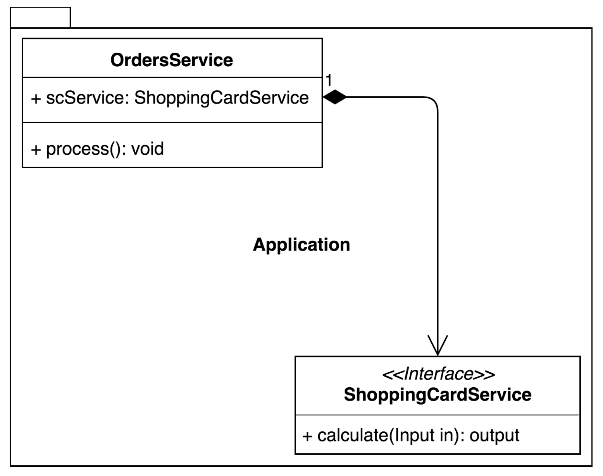

## Why Reactive Spring?

### Reactivity on the service level

The most popular traditional technique for writing code in Java is **imperative programming.**

Let's consider the next diagram:



OrdersService callsShoppingCardServicewhile processing the user request. Suppose that under the hood ShoppingCardService executes a long-running I/O operation, for example, an HTTP request or database query. To understand the disadvantages of imperative programming let's consider the following example of the most common implementation of the aforementioned interaction between components:

```
interface ShoppingCardService {                                    // (1)
   Output calculate(Input value);                                  //
}                                                                  //

class OrdersService {                                              // (2)
   private final ShoppingCardService scService;                    //
                                                                   //
   void process() {                                                //
      Input input = ...;                                           //
      Output output = scService.calculate(input);                  // (2.1)
      ...                                                          // (2.2)
   }                                                               //
}                                                                  //

```

As we can understand from the preceding code, in Java world, the execution of scService.calculate(input) blocks the Thread on which the processing of the OrdersService logic takes place. Thus, to run a separate independent processing in OrderService we have to allocate an additional Thread.As we will see in this chapter, the allocation of an additional Thread might be wasteful.

Nonetheless, in Java, that problem may be solved by applying a callback technique for the purpose of  cross-component communication:

```
interface ShoppingCardService {                                    // (1)
   void calculate(Input value, Consumer<Output> c);                //
}                                                                  //

class OrdersService {                                              // (2)
   private final ShoppingCardService scService;                    // 
                                                                   //                                                
   void process() {                                                //
      Input input = ...;                                           //
      scService.calculate(input, output -> {                       // (2.1)
...                                                       // (2.2)
      });                                                          //
   }                                                               //
}                                                                  //
```

Now,OrdersService passes the function-callback to react at the end of the operation. This embraces the fact thatOrdersService is now decoupled fromShoppingCardService and the first one may be notified via the functional callback where the implementation of theShoppingCardService#calculate  method, which calls the given function, may either be synchronous or asynchronous:

```
class SyncShoppingCardService implements ShoppingCardService {     // (1)
   public void calculate(Input value, Consumer<Output> c) {        //
      Output result = new Output();                                //
      c.accept(result);                                            // (1.1)
   }                                                               //
}                                                                  //

class AsyncShoppingCardService implements ShoppingCardService{    // (2)
   public void calculate(Input value, Consumer<Output> c) {        //
      new Thread(() -> {                                           // (2.1)
         Output result = template.getForObject(...);               // (2.2) 
         ...                                                       //
         c.accept(result);                                        // (2.3)
      }).start();                                                  // (2.4)
   }                                                               //
}                                                                  //
```
This point is the SyncShoppingCardService class declaration. This implementation assumes the absence of blocking operations. Since we do not have an I/O execution, the result may be returned immediately by passing it to the callback function (1.1).
This point in the preceding code is the AsyncShoppingCardService class declaration. In the case, when we have blocking I/O as depicted in point (2.2), we may wrap it in the separate Thread (2.1)(2.4). After retrieving the result,  it will be processed and passed to the callback function.

The advantage of that technique is that components are decoupled in time by the callback function. This means that after calling the scService.calculate method, we will be able to proceed with other operations immediately without waiting for the response in the blocking fashion from ShoppingCardService.

Fortunately, the callback technique is not the only option. Another one is  java.util.concurrent.Future, which, to some degree, hides the executionalbehavior and decouples components as well:

```
interface ShoppingCardService {                                    // (1)
   Future<Output> calculate(Input value);                          // 
}                                                                  //

class OrdersService {                                              // (2)
   private final ShoppingCardService scService;                    //
                                                                   //
   void process() {                                                //
      Input input = ...;                                           //
      Future<Output> future = scService.calculate(input);          // (2.1)
      ...                                                          //
      Output output = future.get();                                // (2.2)
      ...                                                          //
   }                                                               //
}                                                                  //
```

As we may notice from the previous code, with the Future class, we achieve deferred retrieval of the result. With the support of the Future class, we avoid callback hell and hide multi-threading complexity behind a specific Future implementation. Anyway, to get the result we need, we must potentially block the current Thread and synchronize with the external execution that noticeably decreases scalability.

As an improvement, Java 8 offersCompletionStage andCompletableFuture as a direct implementation for CompletionStage. In turn, those classes provide promise-like APIs and make it possible to build code such as the following:

```
interface ShoppingCardService {                                    // (1)
   CompletionStage<Output> calculate(Input value);                 //
}                                                                  //

class OrdersService {                                              // (2)
   private final ComponentB componentB;                            //
   void process() {                                                //
      Input input = ...;                                           //
      componentB.calculate(input)                                  // (2.1)
                .thenApply(out1 -> { ... })                        // (2.2)
                .thenCombine(out2 -> { ... })                      //       
                .thenAccept(out3 -> { ... })                       //
   }                                                               //
}                                                                  //
```

The overall behavior of the CompletionStage is similar to Future, but CompletionStage provides a fluent API which makes it possible to write methods such as thenAccept andthenCombine. These define transformational operations on the result and thenAccept, which defines the final consumers, to handle the transformed result.

The fact that CPU time will be shared between several threads introduces the notion of **context switching. This means that to resume a thread later, it is required to save and load registers, memory maps, and other related elements which in general are computationally-intensive operations. Consequently, its application with a high number of active threads, and few CPUs, will be inefficient.**

In turn, a typical Java thread has its overhead in memory consumption. A typical stack size for a thread on a 64-bit Java VM is 1,024 KB. **On the other hand, by switching to traditional thread pools with a limited size and a pre-configured queue for requests, the client waits too long for a response, which is less reliable, increases the average response timeout, and finally may cause unresponsiveness of the application.**

# Chapter 2. Reactive Programming in Spring - Basic Concepts

## Early reactive solutions in Spring

We have previously mentioned that there are a lot of patterns and programming techniques that are capable of becoming building blocks for the reactive system. For example, callbacks and CompletableFuture are commonly used to implement the message-driven architecture.

### Observer pattern

At first glance, it may appear that the Observer pattern is not related to reactive programming. However it defines the foundations of reactive programming.

The Observer pattern involves a subject that holds a list of its dependants, called Observers. The subject notifies its observers of any state changes, usually by calling one of their methods. 


As the preceding diagram shows, a typical Observer pattern consists of two interfaces, Subject and Observer. Here, an Observer is registered in Subject and listens for notifications from it. A Subject may generate events on its own or may be called by other components. Let's define a Subject interface in Java:

```
public interface Subject<T> {
   void registerObserver(Observer<T> observer);
   void unregisterObserver(Observer<T> observer);
   void notifyObservers(T event);
}
```

In turn, theObserverinterface may look like the following:

```
public interface Observer<T> {
   void observe(T event);
}
```

A third component may be responsible for finding all of the instances of the Subject and all registration procedures. For example, such a role may come intoplay with the Dependency Injection container. This scans the classpath for eachObserver with the@EventListenerannotation and the correct signature. After that, it registers the found components to theSubject.

Now, let's implement two very simple observers that simply receive String messages and print them to the output stream:

```
public class ConcreteObserverA implements Observer<String> {
   @Override
   public void observe(String event) {
      System.out.println("Observer A: " + event);
   }
}
public class ConcreteObserverB implements Observer<String> {
   @Override
   public void observe(String event) {
      System.out.println("Observer B: " + event);
   }
}
```

We also need to write an implementation of the Subject<String>, which produces String events, as shown in the following code:
   
```
public class ConcreteSubject implements Subject<String> {
   private final Set<Observer<String>> observers =                 // (1)
           new CopyOnWriteArraySet<>();

   public void registerObserver(Observer<String> observer) {
      observers.add(observer);
   }

   public void unregisterObserver(Observer<String> observer) {
      observers.remove(observer);
   }

   public void notifyObservers(String event) {                     // (2)
      observers.forEach(observer -> observer.observe(event));      // (2.1)
   }
}
```

As we can see from the preceding example, the implementation of the Subject holds the Set of observers (1) that are interested in receiving notifications. In turn, a modification (subscription or cancellation of the subscription) of the mentioned Set<Observer> is possible with the support of the registerObserver and unregisterObserver methods. To broadcast events, the Subject has a notifyObservers method (2) that iterates over the list of observers and invokes the observe() method with the actual event (2.1) for each Observer. To be secure in the multithreaded scenario, we use CopyOnWriteArraySet, a thread-safeSetimplementation that creates a new copy of its elements each timethe update operation happens.
   
Do keep in mind that when we have a lot of observers that handle events with some noticeable latency—as introduced by downstream processing—we may parallel message propagation using additional threads or Thread pool. This approach may lead to the next implementation of the notifyObservers method:

```
private final ExecutorService executorService = 
   Executors.newCachedThreadPool();

public void notifyObservers(String event) {
   observers.forEach(observer ->
           executorService.submit(() -> observer.observe(event)));
}
```

However, with such improvements, we are stepping on the slippery road of homegrown solutions that are usually not the most efficient, and that most likely hide bugs. 

**To prevent excessive resource usage, we may restrict the thread pool size and violate the *liveness* property of the application.** Situations such as this arise when all available threads attempt to push some events to the same sluggish Observer.

### Publish-Subscribe pattern with @EventListener

Spring now provides an ``@EventListener`` annotation for event handling and the ``ApplicationEventPublisher`` class for event publishing.

Here we need to clarify that the ``@EventListener`` and the ``ApplicationEventPublisher`` implement the Publish-Subscribe pattern, which may be seen as a variation of the Observer pattern.

In contrast to the Observer pattern, in the Publish-Subscribe pattern publishers and subscribers don't need to know each other, as is depicted in the following diagram:

 versus the Publish-Subscribe pattern (on the right).png)

The **Event Channel (also known as a message broker or event bus)** may additionally filter incoming messages and distribute them between subscribers. The filtering and routing may happen based on the message content, message topic, or sometimes even both. Consequently, subscribers in a topic-based system will receive all messages published to the topics of interest. 

The Spring Framework's ``@EventListener`` annotation makes it possible to apply both topic-based and content-based routing.

### Building applications with @EventListener

Server-Sent Events (SSE) allows a client to receive automatic updates from a server, and is commonly used to send message updates or continuous data streams to a browser.

### Bootstrapping a Spring application

**Our application will not use the new features of Spring 5, so it will run similarly on Spring Framework 4.x.** To simplify our development process and even more, we are leveraging Spring Boot.

### Implementing business logic

```
final class Temperature {
   private final double value;
   // constructor & getter...
}
```

```
@Component
public class TemperatureSensor {
   private final ApplicationEventPublisher publisher;              // (1)
   private final Random rnd = new Random();                        // (2)
   private final ScheduledExecutorService executor =               // (3)
           Executors.newSingleThreadScheduledExecutor();

   public TemperatureSensor(ApplicationEventPublisher publisher) {
      this.publisher = publisher;
   }

   @PostConstruct
   public void startProcessing() {                                 // (4)
      this.executor.schedule(this::probe, 1, SECONDS);
   }

   private void probe() {                                          // (5)
      double temperature = 16 + rnd.nextGaussian() * 10;
      publisher.publishEvent(new Temperature(temperature));

      // schedule the next read after some random delay (0-5 seconds)
      executor
        .schedule(this::probe, rnd.nextInt(5000), MILLISECONDS);    // (5.1)
   }
}
```

``ApplicationEventPublisherclass`` (1), provided by Spring Framework. This class makes it possible to publish events to the system. 

### Asynchronous HTTP with Spring Web MVC

**The introduced in Servlet 3.0 asynchronous support expands the ability to process an HTTP request in non-container threads.** Such a feature is pretty useful for long-running tasks.

With those changes, in Spring Web MVC we can return not only a value of type ``T`` in ``@Controller`` but also a ``Callable<T>`` or a ``DeferredResult<T>``. The ``Callable<T>`` may be run inside a non-container thread, but still, it would be a blocking call. In contrast, ``DeferredResult<T>`` allows an asynchronous response generation on a non-container thread by calling the ``setResult(T result)`` method so it could be used within the event-loop.

``ResponseBodyEmitter`` behaves similarly to ``DeferredResult``, but can be used to send multiple objects, where each object is written separately with an instance of a message converter (defined by the ``HttpMessageConverter`` interface).

The ``SseEmitter extends ResponseBodyEmitter`` and **makes it possible to send many outgoing messages for one incoming request in accordance with SSE's protocol requirements.** Alongside ``ResponseBodyEmitter`` and ``SseEmitter``, Spring Web MVC also respects the ``StreamingResponseBody`` interface. When returned from ``@Controller``, it allows us to send raw data (payload bytes) asynchronously. ``StreamingResponseBodymay`` be very handy for streaming large files without blocking Servlet threads.

### Exposing the SSE endpoint

```
@RestController
public class TemperatureController {
   private final Set<SseEmitter> clients =                          // (1)
      new CopyOnWriteArraySet<>();                    

   @RequestMapping(
      value = "/temperature-stream",                                // (2)
      method = RequestMethod.GET)
   public SseEmitter events(HttpServletRequest request) {           // (3)
      SseEmitter emitter = new SseEmitter();                        // (4)
      clients.add(emitter);                                         // (5)

      // Remove emitter from clients on error or disconnect
      emitter.onTimeout(() -> clients.remove(emitter));             // (6)
      emitter.onCompletion(() -> clients.remove(emitter));          // (7)

      return emitter;                                               // (8)
   }
   @Async                                                           // (9)
   @EventListener                                                   // (10)
   public void handleMessage(Temperature temperature) {             // (11)
      List<SseEmitter> deadEmitters = new ArrayList<>();            // (12)
      clients.forEach(emitter -> {                                      
         try {
            emitter.send(temperature, MediaType.APPLICATION_JSON);  // (13)
         } catch (Exception ignore) {
            deadEmitters.add(emitter);                              // (14)
         }
      });
      clients.removeAll(deadEmitters);                              // (15)
   }
}

```

For the clients' collection, we may use the CopyOnWriteArraySet class from the java.util.concurrent package (1). **Such an implementation allows us to modify the list and iterate over it at the same time.**

The ``SseEmitter`` removes itself from the clients' list when it has finished processing or has reached timeout (6) (7).

We need to be able to receive events about temperature changes. For that purpose, our class has a ``handleMessage()`` method (11). It is decorated with the ``@EventListener`` annotation (10) in order to receive events from Spring. This framework will invoke the ``handleMessage()`` method only when receiving ``Temperature`` events, as this type of method's argument is known as temperature. The ``@Async`` annotation (9) marks a method as a candidate for the asynchronous execution, so it is invoked in the manually configured thread pool.

### Configuring asynchronous support 

```
@EnableAsync                                                         // (1)
@SpringBootApplication                                               // (2)
public class Application implements AsyncConfigurer {

   public static void main(String[] args) {
      SpringApplication.run(Application.class, args);
   }

   @Override
   public Executor getAsyncExecutor() {                              // (3)
      ThreadPoolTaskExecutor executor = new ThreadPoolTaskExecutor();// (4)
      executor.setCorePoolSize(2);
      executor.setMaxPoolSize(100);
      executor.setQueueCapacity(5);                                  // (5) 
      executor.setRejectedExecutionHandler(new ThreadPoolExecutor.CallerRunsPolicy()); //My code (6)
      executor.initialize();
      return executor;
   }

   @Override
   public AsyncUncaughtExceptionHandler getAsyncUncaughtExceptionHandler(){
      return new SimpleAsyncUncaughtExceptionHandler();              // (6)
   }
}
```

``ThreadPoolTaskExecutor`` with two core threads that may be increased to up to one hundred threads. It is important to note that without a properly configured queue capacity (5), the thread pool is not able to grow. That is because the SynchronousQueuewould be used instead, limiting concurrency.
When ThreadPoolTaskExecutor gets overloaded, it has a policy ``AbortPolicy``, which halts completely. Other policies like ``CallerRunsPolicy`` are more approriate.

### Criticism of the solution

* We are using the Publish-Subscribe infrastructure provided by Spring. In Spring Framework, **this mechanism** was initially introduced for handling application life cycle events, and **was not intended for high-load, high-performance scenarios.**
* Furthermore, one significant downside of such an approach lies in the fact that we are using an internal Spring mechanism to define and implement our business logic. This leads to a situation in which some minor changes in the framework may break our application.
* ``@EventListener`` does not define a signal the end of the stream or error between components.

## RxJava as a reactive framework

The RxJava library is a Java VM implementation of Reactive Extensions (also known as ReactiveX). ReactiveX is often defined as a combination of the Observer pattern, the Iterator pattern, and functional programming.

### Observer plus iterator equals Reactive Stream

Let's have a recap of the interfaces defined by that pattern, as shown in the following code:
```
public interface Observer<T> {
   void notify(T event);
}

public interface Subject<T> {
   void registerObserver(Observer<T> observer);
   void unregisterObserver(Observer<T> observer);
   void notifyObservers(T event);
}
```

To retrieve items one by one, ``Iterator`` provides the ``next()`` method and also makes it possible to signal the end of the sequence by returning a false value as a result of the hasNext() call. So what would happen if we tried to mix this idea with an asynchronous execution provided by the Observer pattern? The result would look like the following:
```
public interface RxObserver<T> {
   void onNext(T next);
   void onComplete();
   void onError(Exception e);
}
```

The ``RxObserver`` is pretty similar to the ``Iterator``, but instead of calling the ``next()`` method of ``Iterator``, ``RxObserver`` would be notified with a new value by the ``onNext()`` callback. And instead of checking whether the result of the ``hasNext()`` method is positive, ``RxObserver`` is informed about the end of the stream through the invoked ``onComplete()`` method.

The ``Observable`` Reactive class is a counterpart to the ``Subject`` from the Observer pattern. As a consequence, ``Observable`` plays a role as an **events source as it emits items.**

A ``Subscriber`` abstract class implements the ``Observer`` interface and consumes items. It is also used as a base for the actual ``Subscriber's`` implementation. The runtime relation between ``Observable`` and ``Subscriber`` controlled by a ``Subscription`` that makes it possible to check the subscription status and cancelit if needed.

### Producing and consuming streams

```
Observable<String> observable = Observable.create(
   sub -> {
      sub.onNext("Hello, reactive world!"); //(1)
      sub.onCompleted();                    //(2)
   }
);
```

At that moment, our Observer will produce a one string value (1) and then signal the end of the stream to the subscriber (2).

Subscriber:
```
Subscriber<String> subscriber = new Subscriber<String>() {
   @Override
   public void onNext(String s) {                                    // (1)
      System.out.println(s);
   }

   @Override
   public void onCompleted() {                                       // (2)
      System.out.println("Done!");
   }

   @Override
   public void onError(Throwable e) {                                // (3)
      System.err.println(e);
   }
};
```

Combine several ``Observable``s:
```
Observable<String> observable = Observable.create(
    sub -> {
        sub.onNext("Hello");
        sub.onCompleted();
    }
);
Observable<String> observable2 = Observable.create(
    sub -> {
        sub.onNext(" world");
        sub.onCompleted();
    }
);

Observable.concat(observable, observable2, Observable.just("!"))
    .forEach(System.out::print);

```

### Generating an asynchronous sequence

RxJava makes it possible to generate not only one event in the future, but an asynchronous sequence of events based:
```
Observable.interval(1, TimeUnit.SECONDS)
   .subscribe(e -> System.out.println("Received: " + e));
Thread.sleep(5000);                                                  // (1)
```

Also, if we remove Thread.sleep(...) (1), our application will exit without any output. This happens because events would be generated and therefore consumed in a separate daemon thread. So, to prevent the main thread from finishing the execution, we may sleep() or do some other useful tasks.

Of course, there is something that controls theObserver-Subscriber cooperation. This is called Subscription, and has the following interface declaration:
```
interface Subscription {
   void unsubscribe();
   boolean isUnsubscribed();
}
```

To understand the mentioned unsubscribe functionality, let's consider the case where a subscriber is the only party interested in the events, and consumes them until an external signal is propagated by CountDawnLatch:
```
CountDownLatch countDownLatch = new CountDownLatch(0);

Subscription subscribe = Observable
       .interval(100, TimeUnit.MILLISECONDS)
       .subscribe(System.out::println);

TimeUnit.SECONDS.sleep(2);
countDownLatch.await();
subscribe.unsubscribe();
TimeUnit.SECONDS.sleep(2);
```

### Stream transformation and marble diagrams

Even though ``Observable`` and ``Subscriber`` alone make it possible to implement a lot of workflows, the whole power of RxJava is hidden in its operators. Operators are used for tweaking elements of the stream or changing the stream structure itself.

#### Map operator

```
<R> Observable<R> map(Func1<T, R> func)
```

Applying map transforms ``Observable<T>`` into ``Observable<R>``.

**Marble diagrams** visually present stream transformations. They are so effective for describingthe operator's behavior that almost all RxJava operators containthe image with a marble diagram in Javadoc.


#### Filter operator

It only emits those elements that have successfully passedthe predicate test, as shown in the following diagram:


#### Count operator

It emits the only value with the number of elements in the input stream. However, the count emits at the moment when the original stream completes, so, in the case of an **endless stream, the count will not ever finish or return anything, as shown in the following diagram:**


#### Zip operator

Combines values from two parallel streams by applying a zip function. It is often used for data enrichment, especially when parts of an expected result are retrieved from different sources:


```
Observable.zip(
        Observable.just("A", "B", "C"),
        Observable.just("1", "2", "3"),
        (x, y) -> x + y
).forEach(System.out::println);
```
**To learn more about operators that are commonly used in reactive programming (not only in RxJava) visithttp://rxmarbles.com.**

### Prerequisites and benefits of RxJava

Different reactive libraries may have slightly different APIs and somewhat various implementation details, but the concept remains the same - the subscriber subscribes to an observable stream that in turn triggers an asynchronous process of event generation. Between the producer and subscriber, there usually exists some subscription that makes it possible to break up the producer-consumer relationship.

### Rebuilding our application with RxJava

#### Implementing business logic

```
@Component                                                          // (1)
public class TemperatureSensor {
   private final Random rnd = new Random();                         // (2)

   private final Observable<Temperature> dataStream =               // (3)
      Observable
         .range(0, Integer.MAX_VALUE)                               // (4)
         .concatMap(tick -> Observable                              // (5)
            .just(tick)                                             // (6)
            .delay(rnd.nextInt(5000), MILLISECONDS)                 // (7)
            .map(tickValue -> this.probe()))                        // (8)
         .publish()                                                 // (9)
         .refCount();                                               // (10)

   private Temperature probe() {
      return new Temperature(16 + rnd.nextGaussian() * 10);         // (11)
   }

   public Observable<Temperature> temperatureStream() {             // (12)
      return dataStream;
   }
}
```

Our sensor holds the random number generator rnd to simulate actual hardware sensor measurements (2). In a statement, (3), we define a private field called ``dataStream``, which is returned by the public method ``temperatureStream()``(12). Thus, ``dataStream`` is the only ``Observable`` stream defined by the component. This stream generates an effectively endless flow of numbers (4) by applying the factory method ``range(0, Integer.MAX_VALUE)``. The ``range()`` method generates a sequence of integers starting from 0 that have Integer.MAX_VALUE elements. For each of these values, we apply the transformation (5) ``concatMap(tick -> ...)``. The method ``concatMap()`` receives a function, f, that transforms an tick item into an observable stream of elements, applies the f function to each element of the incoming stream, and joins the resulting streams one by one. In our case, the f function makes a sensor measurement after a random delay (to match the behavior of the previous implementation). To probe a sensor, we create a new stream with only one element tick(6). To simulate a random delay, we apply the ``delay(rnd.nextInt(5000), MILLISECONDS)`` (7) Operator, which shifts elementsforward in time.

For the next step, we probe the sensor and retrieve a temperature value by applying the ``map(tickValue -> this.probe()))`` transformation (8), which in turn calls the ``probe()`` method with the same data generation logic as before (11). In that case, we ignore the tickValue, as it was required only to generate a one-element stream. So, after applying the ``concatMap(tick -> ...)``, we have a stream that returns sensor values with a random interval of up to five seconds between emitted elements.

Actually, we could return a stream without applying operators (9) and (10), but in that case, each subscriber (SSE client) **would trigger a new subscription for the stream and a new sequence of sensor readings.** **This means that sensor readings would not be shared among subscribers** that could lead to hardware overload and degradation. To prevent this, we use the publish() (9) operator, which broadcasts events from a source stream to all destination streams. The publish() operator returns a special kind ofObservablecalled ConnectableObservable. The latter provides the ``refCount()`` (10) operator, which **creates a subscription to the incoming shared stream only when there is at least one outgoing subscription.** In contrast with the Publisher-Subscriber implementation, this one makes it possible not to probe the sensor when nobody listens.

### Custom SseEmitter

By using TemperatureSensor, which exposes a stream using temperature values, we may subscribe each new SseEmitter to the Observable stream and send the received onNext signals to SSE clients.

```
class RxSeeEmitter extends SseEmitter {
   static final long SSE_SESSION_TIMEOUT = 30 * 60 * 1000L;
   private final Subscriber<Temperature> subscriber;                // (1)

   RxSeeEmitter() {
      super(SSE_SESSION_TIMEOUT);                                   // (2)

      this.subscriber = new Subscriber<Temperature>() {             // (3)
         @Override
         public void onNext(Temperature temperature) {
            try {
               RxSeeEmitter.this.send(temperature);                 // (4)
            } catch (IOException e) {
               unsubscribe();                                       // (5)
            }
         }

         @Override
         public void onError(Throwable e) { }                       // (6)

         @Override
         public void onCompleted() { }                              // (7)
      };

      onCompletion(subscriber::unsubscribe);                        // (8)
      onTimeout(subscriber::unsubscribe);                           // (9)
   }

   Subscriber<Temperature> getSubscriber() {                        // (10)
      return subscriber;
   }
}
```

This subscriber reacts to the received ``onNext`` signals by resending them to an SSE client (4). In cases where the data sending fails, the subscriber unsubscribes itself from the incoming observable stream (5). In the current implementation, we know that the temperature stream is infinite and cannot produce any errors, so the ``onComplete()`` and ``onError()`` handlers are empty (6), (7), but in real applications, it is better to have some handlers there.

Lines (8) and (9) register cleanup actions for SSE session completion or timeout. The ``RxSeeEmitter`` subscribers should cancel the subscription. To use a subscriber, ``RxSeeEmitter`` exposes it by utilizing the ``getSubscriber()`` method (10).

### Exposing the SSE endpoint

```
@RestController
public class TemperatureController {
   private final TemperatureSensor temperatureSensor;                // (1)

   public TemperatureController(TemperatureSensor temperatureSensor) {
      this.temperatureSensor = temperatureSensor;
   }

   @RequestMapping(
      value = "/temperature-stream",
      method = RequestMethod.GET)
   public SseEmitter events(HttpServletRequest request) {
      RxSeeEmitter emitter = new RxSeeEmitter();                     // (2)

      temperatureSensor.temperatureStream()                          // (3)
         .subscribe(emitter.getSubscriber());                        // (4)

      return emitter;                                                // (5)
   }
}
```

When a new SSE session is created, the controller instantiates our augmented ``RxSeeEmitter`` (2) and subscribes to the ``RxSeeEmitter`` subscribers (4) to the temperature stream referenced from the ``TemperatureSensor`` instance (3). Then the ``RxSeeEmitter`` instance is returned to the Servlet container for processing (5).

### Application configuration
```
@SpringBootApplication
public class Application {
   public static void main(String[] args) {
      SpringApplication.run(Application.class, args);
   }
}
```

As we can see with RxJava:
* REST controller holds less logic, does not manage the dead SseEmitter instances, and does not care about synchronization
* This implementation does not use Spring's EventBus, so it is more portable and can be tested without initializing a Spring context.
* Do not need to enable Async Support using the @EnableAsync annotation, 
* Do not need to configure Spring's Executorfor event handling

### Reactive landscape

**Reactive Streams** standard was designed to unify multiple different libraries and implementations.

# Chapter 3. Reactive Streams - the New Streams' Standard

In this chapter, we are going to cover some of the problems mentioned in the previous chapter, along with those that arise when several reactive libraries meet in one project.

## Reactivity for everyone

### The API's inconsistency problem

On the other hand, the abundance of choices may easily over-complicate the system. For example, the presence of two libraries that rely on an asynchronous non-blocking communication concept but have a different API leads to providing an additional utility class in order to convert one callback into another and vice versa.

Here, the central problem lies in the fact that there is no single method that allows library vendors to build their aligned API.

### Pull versus push

During the early period of the whole reactive landscape evolution, all libraries were designed with the thought that **data is pushed from the source to the subscriber.** That decision was made because a pure pull model is not efficient enough in some cases. An example of this is when communication over the network appeared in the system with network boundaries. Suppose that we filter a huge list of data but take only the first ten elements from it.


