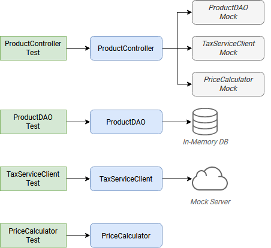
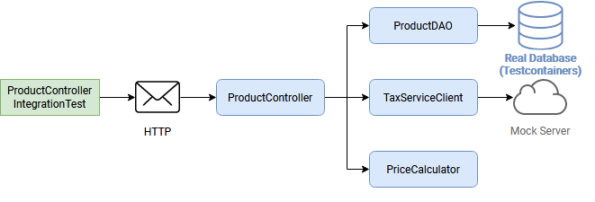

[Source](https://phauer.com/2019/modern-best-practices-testing-java/)

# TL;DR

* Write small and specific tests by heavily using helper functions, parameterized tests, AssertJ’s powerful assertions, not overusing variables, asserting only what’s relevant and avoiding one test for all corner cases.
* Write self-contained tests by revealing all relevant parameters, insert data right in the test and prefer composition over inheritance.
* Write dumb tests by avoiding the reuse of production code and focusing on comparing output values with hard-coded values.
* KISS > DRY
* Test close to production by focusing on testing a complete vertical slide and avoiding in-memory databases.
* JUnit5 and AssertJ are a very good choice.
* Invest in a testable implementation by avoiding static access, using constructor injection, using Clocks and separating business logic from asynchronous execution.


# General
## Given, When, Then

A test should contain three blocks which are separated by one empty line. Each block of code should be as short as possible. Use subfunctions to shorten these blocks.

* Given (Input): Test preparation like creating data or configure mocks
* When (Action): Call the method or action that you like to test
* Then (Output): Execute assertions to verify the correct output or behavior of the action.

```
// Do
@Test
public void findProduct() {
    insertIntoDatabase(new Product(100, "Smartphone"));

    Product product = dao.findProduct(100);

    assertThat(product.getName()).isEqualTo("Smartphone");
}
```

## Use the Prefixes "actual\*" and "expected\*"

```
// Don't
ProductDTO product1 = requestProduct(1);

ProductDTO product2 = new ProductDTO("1", List.of(State.ACTIVE, State.REJECTED))
assertThat(product1).isEqualTo(product2);
```

If you are going to use variables in an equals assertion, prefix the variables with “actual” and “expected”. This increases the readability and clearifies the intention of the variable. Moreover, it’s harder to mix them up in the equals assertion.

```
// Do
ProductDTO actualProduct = requestProduct(1);

ProductDTO expectedProduct = new ProductDTO("1", List.of(State.ACTIVE, State.REJECTED))
assertThat(actualProduct).isEqualTo(expectedProduct); // nice and clear.
```

## Use Fixed Data Instead of Randomized Data

Avoid randomized data as it can lead to toggling tests which can be hard to debug and omit error messages that make tracing the error back to the code harder.

```
// Don't
Instant ts1 = Instant.now(); // 1557582788
Instant ts2 = ts1.plusSeconds(1); // 1557582789
int randomAmount = new Random().nextInt(500); // 232
UUID uuid = UUID.randomUUID(); // d5d1f61b-0a8b-42be-b05a-bd458bb563ad
```

Instead, use fixed values for everything. They will create highly reproducible tests, which are easy to debug and create error messages that can be easily traced back to the relevant line of code.

```
// Do
Instant ts1 = Instant.ofEpochSecond(1550000001);
Instant ts2 = Instant.ofEpochSecond(1550000002);
int amount = 50;
UUID uuid = UUID.fromString("00000000-000-0000-0000-000000000001");
```

You can avoid the increased typing effort by using helper functions.

# Write Small and Specific Tests
## Heavily Use Helper Functions

Extract details or repetitive code into subfunctions and give them a descriptive name. This is a powerful mean to keep the tests short and the essentials of the test easy to grasp at first glance.

```
// Don't
@Test
public void categoryQueryParameter() throws Exception {
    List<ProductEntity> products = List.of(
            new ProductEntity().setId("1").setName("Envelope").setCategory("Office").setDescription("An Envelope").setStockAmount(1),
            new ProductEntity().setId("2").setName("Pen").setCategory("Office").setDescription("A Pen").setStockAmount(1),
            new ProductEntity().setId("3").setName("Notebook").setCategory("Hardware").setDescription("A Notebook").setStockAmount(2)
    );
    for (ProductEntity product : products) {
        template.execute(createSqlInsertStatement(product));
    }

    String responseJson = client.perform(get("/products?category=Office"))
            .andExpect(status().is(200))
            .andReturn().getResponse().getContentAsString();

    assertThat(toDTOs(responseJson))
            .extracting(ProductDTO::getId)
            .containsOnly("1", "2");
}
```

```
// Do
@Test
public void categoryQueryParameter2() throws Exception {
    insertIntoDatabase(
            createProductWithCategory("1", "Office"),
            createProductWithCategory("2", "Office"),
            createProductWithCategory("3", "Hardware")
    );

    String responseJson = requestProductsByCategory("Office");

    assertThat(toDTOs(responseJson))
            .extracting(ProductDTO::getId)
            .containsOnly("1", "2");
}
```

* Use helper functions for creating data (objects) (createProductWithCategory()) and complex assertions. Only pass those parameters to the helper functions that are relevant for your tests. Use reasonable defaults for the other values.
* varargs can make your test code even more concise (ìnsertIntoDatabase()).
* Helper functions can also be used to create simple values more easily.

```
// Do (Java)
Instant ts = toInstant(1); // Instant.ofEpochSecond(1550000001)
UUID id = toUUID(1); // UUID.fromString("00000000-0000-0000-a000-000000000001")
```

# Don’t Overuse Variables

A usual reflex of a developer is to extract values that are used multiple times to variables.

```
// Don't
@Test
public void variables() throws Exception {
    String relevantCategory = "Office";
    String id1 = "4243";
    String id2 = "1123";
    String id3 = "9213";
    String irrelevantCategory = "Hardware";
    insertIntoDatabase(
            createProductWithCategory(id1, relevantCategory),
            createProductWithCategory(id2, relevantCategory),
            createProductWithCategory(id3, irrelevantCategory)
    );

    String responseJson = requestProductsByCategory(relevantCategory);

    assertThat(toDTOs(responseJson))
            .extracting(ProductDTO::getId)
            .containsOnly(id1, id2);
}
```

Unfortunately, this significantly bloats the test code. Moreover, given a test failure message, it’s harder to trace the value back to the relevant line of code.

**KISS > DRY**

```
// Do
@Test
public void variables() throws Exception {
    insertIntoDatabase(
            createProductWithCategory("4243", "Office"),
            createProductWithCategory("1123", "Office"),
            createProductWithCategory("9213", "Hardware")
    );

    String responseJson = requestProductsByCategory("Office");

    assertThat(toDTOs(responseJson))
            .extracting(ProductDTO::getId)
            .containsOnly("4243", "1123");
}
```

If you keep the tests short (which is highly recommended anyway), it’s no problem to see where the same values are used. Plus, the method is even shorter and therefore easier to understand. And finally, failure messages are easier to trace back to the code.

# Don’t Extend Existing Tests To “Just Test One More Tiny Thing”

```
// Don't
public class ProductControllerTest {
    @Test
    public void happyPath() {
        // a lot of code comes here...
    }
}
```

It’s tempting to add a corner case test to an existing (happy path) test. But this test becomes bigger and harder to understand. It becomes hard to grasp all relevant test cases that are covered by this big test. You can spot those tests by generic names like “happy path test”. If this test fails, it’s hard to see what exactly is broken.

```
// Do
public class ProductControllerTest {
    @Test
    public void multipleProductsAreReturned() {}
    @Test
    public void allProductValuesAreReturned() {}
    @Test
    public void filterByCategory() {}
    @Test
    public void filterByDateCreated() {}
}
```

Instead, create a new test method with a descriptive name that tells everything about the expected behavior. Yes, it’s more writing effort but you can create a tailored and clear test, that only test the relevant behavior. Again, helper functions can reduce the typing effort. And finally, adding tailored tests with descriptive names is a great way of documenting the implemented behavior.

# Assert Only What You Want to Test

Think about what you actually want to test. Avoid asserting more things just because you can do it. Moreover, keep in mind what you have already tested in former tests; you usually don’t have to assert that again and again in every test. This keeps the tests short and states clearly and without any distraction the expected behavior.

Let’s consider an example: We like to test an HTTP endpoint which returns products. Our tests suite should contain the following tests:

* One bigger “mapping test” that assert all values from the database are correctly returned in the JSON payload and got mapped correctly to the correct format. We can do this easily by using AssertJ’s isEqualTo() (for a single element) or containsOnly() (for multiple elements) if you have implemented equals() correctly.

```
String responseJson = requestProducts();

ProductDTO expectedDTO1 = new ProductDTO("1", "evelope", new Category("office"), List.of(States.ACTIVE, States.REJECTED));
ProductDTO expectedDTO2 = new ProductDTO("2", "evelope", new Category("smartphone"), List.of(States.ACTIVE));
assertThat(toDTOs(responseJson)).containsOnly(expectedDTO1, expectedDTO2);
```

* Some tests checking the correct behavior of the query parameter ?category. So we want to test the correct filtering; not if all properties are correctly set. We have already done that in the above test. Consequently, it’s enough to compare only the returned product ids.

```
String responseJson = requestProductsByCategory("Office");

assertThat(toDTOs(responseJson))
        .extracting(ProductDTO::getId)
        .containsOnly("1", "2");
```

* Some tests checking corner cases or special business logic. For instance, if a certain value in the payload is calculated correctly. In this case, we may only be interested in a certain JSON field of the payload. So we should only check the relevant field to clearly state and document the scope of the logic under test. Again, there is no need to assert all fields again, because there are not relevant here.

```
assertThat(actualProduct.getPrice()).isEqualTo(100);
```

# Self-Contained Tests

## Don’t Hide the Relevant Parameters (in Helper Functions)
```
// Don't
insertIntoDatabase(createProduct());
List<ProductDTO> actualProducts = requestProductsByCategory();
assertThat(actualProducts).containsOnly(new ProductDTO("1", "Office"));
```

Yes, you should use helper functions for creating data and assertions, but you have to parameterize them. Define a parameter for everything that is important for the test and needs to be controlled by the test. Don’t force the reader to jump to a function definition in order to understand the test. Rule of thumb: You should see the essentials of a test by looking only at the test method.

```
// Do
insertIntoDatabase(createProduct("1", "Office"));
List<ProductDTO> actualProducts = requestProductsByCategory("Office");
assertThat(actualProducts).containsOnly(new ProductDTO("1", "Office"));
```

# Insert Test Data Right In The Test Method

Everything needs to be right in the test method. It’s tempting to move reusable data insertion code to the @Before method, but this would force the reader to jump around in order to fully understand what’s going on. Again, helper functions for data insertion can help to make this repetitive task a one-liner.
Favor Composition Over Inheritance

## Don’t build up complex inheritance hierarchies for the test classes.
```
// Don't
class SimpleBaseTest {}
class AdvancedBaseTest extends SimpleBaseTest {}
class AllInklusiveBaseTest extends AdvancedBaseTest {}
class MyTest extends AllInklusiveBaseTest {}
```

Those hierarchies are hard to understand and you likely end up extending a base test that contains a lot of stuff that the current test doesn’t need. This distracts the reader and can lead to bugs. Inheritance is not flexible: It’s not possible to use everything from AllInklusiveBaseTest but nothing from its superclass AdvancedBaseTest? Moreover, the reader has to jump between multiple base classes to understand the big picture.

**"Prefer duplication over the wrong abstraction". Sandi Metz. See "Wall of Coding Wisdom"**

Instead, I recommend using composition. Write small code snippets and classes for each specific fixture work (start the test database, create the schema, insert data, start a mock web server). Reuse those parts in your tests in the @BeforeAll method or by assigning the created objects to fields of the test class. So you assemble every new test class by reusing those parts; like lego bricks. This way, every test has its own tailored fixture that is easy to grasp and nothing unrelated is happening. The test class is self-contained because everything relevant is right in the test class.

```
// Do
public class MyTest {
    // composition instead of inheritance
    private JdbcTemplate template;
    private MockWebServer taxService;

    @BeforeAll
    public void setupDatabaseSchemaAndMockWebServer() throws IOException {
        this.template = new DatabaseFixture().startDatabaseAndCreateSchema();
        this.taxService = new MockWebServer();
        taxService.start();
    }
}

// In a different File
public class DatabaseFixture {
    public JdbcTemplate startDatabaseAndCreateSchema() throws IOException {
        PostgreSQLContainer db = new PostgreSQLContainer("postgres:11.2-alpine");
        db.start();
        DataSource dataSource = DataSourceBuilder.create()
                .driverClassName("org.postgresql.Driver")
                .username(db.getUsername())
                .password(db.getPassword())
                .url(db.getJdbcUrl())
                .build();
        JdbcTemplate template = new JdbcTemplate(dataSource);
        SchemaCreator.createSchema(template);
        return template;
    }
}
```
Again:

**KISS > DRY**

# Dumb Tests Are Great: Compare the Output with Hard-Coded Values
## Don’t Reuse Production Code

Test should test the production code; not reuse it. If you reuse production code in a test, you might miss a bug that is introduced in the reused code because you don’t test this code anymore.
```
// Don't
boolean isActive = true;
boolean isRejected = true;
insertIntoDatabase(new Product(1, isActive, isRejected));

ProductDTO actualDTO = requestProduct(1);

// production code reuse ahead
List<State> expectedStates = ProductionCode.mapBooleansToEnumList(isActive, isRejected);
assertThat(actualDTO.states).isEqualTo(expectedStates);
```

Instead, think in terms of input and output when writing tests. The test sets the input and compares the actual output with hard-coded values. Most of the time, code reuse is not required.
```
// Do
assertThat(actualDTO.states).isEqualTo(List.of(States.ACTIVE, States.REJECTED));
```

## Don’t Rewrite Production Logic

Mapping code is a common example where the logic in tests is rewritten. So let’s assume our tests contains a method mapEntityToDto() which result is used to assert that a returned DTO contains the same values than the entities that have been inserted at the beginning of the test. In this case, you’ll most likely end up rewriting the production logic in the test code, which can contains bugs.
```
// Don't
ProductEntity inputEntity = new ProductEntity(1, "evelope", "office", false, true, 200, 10.0);
insertIntoDatabase(input);

ProductDTO actualDTO = requestProduct(1);

 // mapEntityToDto() contains the same mapping logic as the production code
ProductDTO expectedDTO = mapEntityToDto(inputEntity);
assertThat(actualDTO).isEqualTo(expectedDTO);
```

Again, the solution is to compare the actualDTO with a manually created reference object with hard-coded values. That’s dead-simple, easy to understand and less error-prone.

```
// Do
ProductDTO expectedDTO = new ProductDTO("1", "evelope", new Category("office"), List.of(States.ACTIVE, States.REJECTED))
assertThat(actualDTO).isEqualTo(expectedDTO);
```

If you don’t want to compare all values and you therefore don’t want to create a complete reference object, consider to only compare subobjects or just the relevant values.

# Don’t Write Too Much Logic

Again, testing is mostly about input and output: Providing input and compare the actual output with the expected values. Hence, we don’t need to code much logic in our tests and we shouldn’t. If you implement logic with many loops and conditions, you make the tests harder to grasp and more error-prone. Moreover, in case of complex assertion logic, AssertJ’s powerful assertions can do the heavy lifting for you.

# Test Close To The Reality

## Focus on Testing A Complete Vertical Slide

Testing each class in isolation by using mocks is a common testing recommendation. However, it has drawbacks: You are not testing all classes in integration and refactorings of the internals will break all tests, because there is a test for each internal class. And finally, you have to write and maintain multiple tests.
Unit Testing each class in isolation and with mocks comes with drawbacks.



Instead, I suggest focussing on integration tests. By “integration tests” I mean putting all classes together (just like in production) and test a complete vertical slide going though all technical layers (HTTP, business logic, database). This way, you are testing behavior instead of an implementation. Those tests are accurate, close to production and robust against refactorings of internals. Ideally, we only have to write a single test class.
I recommend to focus on integration test (= wiring real objects together and test all at once)



Still, unit tests are useful and there are situations where a unit test is the better choice or where it make sense to combine both approaches. However, my experience is that an integration test is the better and sufficient choice most of the time.

# Don’t Use In-Memory Databases For Tests

With an in-memory database, you are testing against a different database than in production.

Using an in-memory database (H2, HSQLDB, Fongo) for tests reduces the reliability and scope of your tests. The in-memory database and the database used in production behave differently and may return different results. So a green in-memory-database-based test is no guaranty for the correct behavior of your application in production. Moreover, you can easily run into situations where you can’t use (or test) a certain (database-specific) feature because the in-memory database doesn’t support it or act differently. For details on this, check out the post ‘Don’t use In-Memory Databases for Tests’.

The solution is to execute the tests against the real database. Fortunately, the library Testcontainers provides an awesome Java API for managing container directly in the test code. To increase the execution speed, see here.

# Use AssertJ

AssertJ is an extremely powerful and mature assertion library with a fluent type-safe API, a huge variety of assertions and descriptive failure messages. There is an assertion for everything you want to do. This prevents you from writing complex assertion logic with loops and conditions while keeping the test code short. Here are some examples:

```
assertThat(actualProduct)
        .isEqualToIgnoringGivenFields(expectedProduct, "id");

assertThat(actualProductList).containsExactly(
        createProductDTO("1", "Smartphone", 250.00),
        createProductDTO("1", "Smartphone", 250.00)
);

assertThat(actualProductList)
        .usingElementComparatorIgnoringFields("id")
        .containsExactly(expectedProduct1, expectedProduct2);

assertThat(actualProductList)
        .extracting(Product::getId)
        .containsExactly("1", "2");

assertThat(actualProductList)
        .anySatisfy(product -> assertThat(product.getDateCreated()).isBetween(instant1, instant2));

assertThat(actualProductList)
        .filteredOn(product -> product.getCategory().equals("Smartphone"))
        .allSatisfy(product -> assertThat(product.isLiked()).isTrue());
```

# Avoid ``assertTrue()`` and ``assertFalse()``

Avoid simple assertTrue() or assertFalse() assertions as they produce cryptic failure messages:

```
// Don't 
assertTrue(actualProductList.contains(expectedProduct));
assertTrue(actualProductList.size() == 5);
assertTrue(actualProduct instanceof Product);

expected: <true> but was: <false>
```

Instead, use AssertJ’s assertions which produce nice failure messages out-of-the-box.

```
// Do
assertThat(actualProductList).contains(expectedProduct);
assertThat(actualProductList).hasSize(5);
assertThat(actualProduct).isInstanceOf(Product.class);

Expecting:
 <[Product[id=1, name='Samsung Galaxy']]>
to contain:
 <[Product[id=2, name='iPhone']]>
but could not find:
 <[Product[id=2, name='iPhone']]>
```

If you really have to check for a boolean, consider AssertJ’s as() to improve the failure message.

# Use JUnit5

JUnit5 is the state of the art for (unit) testing. It’s actively developed and provides many powerful features (like parameterized tests, grouping, conditional tests, lifecycle control).

# Use Parameterized Tests

Parameterized Tests allow rerunning a single test multiple times with different values. This way, you can easily test several cases without writing more test code. JUnit5 provides great means to write those tests with @ValueSource, @EnumSource, @CsvSource, and @MethodSource.

```
// Do
@ParameterizedTest
@ValueSource(strings = ["§ed2d", "sdf_", "123123", "§_sdf__dfww!"])
public void rejectedInvalidTokens(String invalidToken) {
    client.perform(get("/products").param("token", invalidToken))
            .andExpect(status().is(400))
}

@ParameterizedTest
@EnumSource(WorkflowState::class, mode = EnumSource.Mode.INCLUDE, names = ["FAILED", "SUCCEEDED"])
public void dontProcessWorkflowInCaseOfAFinalState(WorkflowState itemsInitialState) {
    // ...
}
```

I highly recommend to extensively use them, because you can test more cases with a minimal amount of effort.

Finally, I like to highlight @CsvSource and @MethodSource which can be used for more advanced parameterized test scenarios where you can also control the expected output with a parameter.
```
@ParameterizedTest
@CsvSource({
    "1, 1, 2",
    "5, 3, 8",
    "10, -20, -10"
})
public void add(int summand1, int summand2, int expectedSum) {
    assertThat(calculator.add(summand1, summand2)).isEqualTo(expectedSum);
}
```

@MethodSource is powerful in conjunction with a dedicated test object containing all relevant test parameters and the expected output.

# Group the Tests

JUnit5’s @Nested is useful to group tests methods. Reasonable groups can be certain types of tests (like InputIsXY, ErrorCases) or one group for each method under test (GetDesign and UpdateDesign).

```
public class DesignControllerTest {
    @Nested
    class GetDesigns {
        @Test
        void allFieldsAreIncluded() {}
        @Test
        void limitParameter() {}
        @Test
        void filterParameter() {}
    }
    @Nested
    class DeleteDesign {
        @Test
        void designIsRemovedFromDb() {}
        @Test
        void return404OnInvalidIdParameter() {}
        @Test
        void return401IfNotAuthorized() {}
    }
}
```

Group the test methods with JUnit5&rsquo;s @Nested

Group the test methods with JUnit5’s @Nested

# Readable Test Names with @DisplayName or Kotlin’s Backticks

In Java, use JUnit5’s @DisplayName to create readable test descriptions.

```
public class DisplayNameTest {
    @Test
    @DisplayName("Design is removed from database")
    void designIsRemoved() {}
    @Test
    @DisplayName("Return 404 in case of an invalid parameter")
    void return404() {}
    @Test
    @DisplayName("Return 401 if the request is not authorized")
    void return401() {}
}
```

Readable test method names with JUnit5&rsquo;s @DisplayName

# Mock Remote Service

In order to test HTTP clients we need to mock the remote service. I often use OkHttp’s WebMockServer for this purpose. Alternatives are WireMock or Testcontainer’s Mockserver.

```
MockWebServer serviceMock = new MockWebServer();
serviceMock.start();
HttpUrl baseUrl = serviceMock.url("/v1/");
ProductClient client = new ProductClient(baseUrl.host(), baseUrl.port());
serviceMock.enqueue(new MockResponse()
        .addHeader("Content-Type", "application/json")
        .setBody("{\"name\": \"Smartphone\"}"));

ProductDTO productDTO = client.retrieveProduct("1");

assertThat(productDTO.getName()).isEqualTo("Smartphone");
```

# Use Awaitility for Asserting Asynchronous Code

Awaitility is a library for testing asynchronous code. You can easily define how often an assertion is retried until it finally fails.

```
private static final ConditionFactory WAIT = await()
        .atMost(Duration.ofSeconds(6))
        .pollInterval(Duration.ofSeconds(1))
        .pollDelay(Duration.ofSeconds(1));

@Test
public void waitAndPoll(){
    triggerAsyncEvent();
    WAIT.untilAsserted(() -> {
        assertThat(findInDatabase(1).getState()).isEqualTo(State.SUCCESS);
    });
}
```

This way, you can avoid using the fragile Thread.sleep() in the tests.

However, testing synchronous code is much easier. That’s why we should try to separate the synchronous and the asynchronous code in order to test them separately.

# No Need to Bootstrap DI (Spring)

Bootstrapping the (Spring) DI framework takes some seconds before the test can start. Especially during the initial development of a test, this slows down the feedback cycle.

That’s why I usually don’t use DI in my integration tests. I instantiate the required objects manually by calling new and plump them together. If you are using constructor injection, this is very easy. Most of the time, you want to test the business logic you have wrote. For this, you don’t need DI. Check out my post on integration tests for an example.

Moreover, Spring Boot 2.2 will introduce an easy way to use lazy bean initialization, which should significantly speed up DI-based tests.

# Make The Implementation Testable

## Don’t Use Static Access. Never. Ever.

Static access is an anti-pattern. First, it obfuscates dependencies and side-effects making the whole code harder to understand and more error-prone. Second, static access harms testability. You can’t exchange the objects anymore. But in a test, you want to use mocks or use the real objects with a different configuration (like a DAO object pointing to a test database).

So instead of access code statically, put it into non-static methods, instantiate the class and pass the object to the constructor of the object where you need it.

```
// Don't 
public class ProductController {
    public List<ProductDTO> getProducts() {
        List<ProductEntity> products = ProductDAO.getProducts();
        return mapToDTOs(products);
    }
}
```
```
// Do 
public class ProductController {
    private ProductDAO dao;
    public ProductController(ProductDAO dao) {
        this.dao = dao;
    }
    public List<ProductDTO> getProducts() {
        List<ProductEntity> products = dao.getProducts();
        return mapToDTOs(products);
    }
}
```

Fortunately, DI frameworks like Spring are providing an easy way to avoid static access because it handles the creation and wiring of all objects for us.

## Parameterize

Make all relevant parts of the class controllable by the test. This can be done by making a parameter for the constructor out of this aspect.

For instance, your DAO has a fixed limit of 1000 for queries. Testing this limit would require you to create 1001 database entries in the test. By using a constructor parameter for this limit you make the limit configurable. In production, this parameter is 1000. In the test, you can use 2. This only requires 3 test entries for testing the limit feature.

## Use Constructor Injection

Field injection is evil due to poor testability. You have to bootstrap the DI environment in your tests or do hacky reflection magic. So constructor injection is the preferred way because it allows you to easily control the dependent object in the test.

In Java, this requires a little bit of boilerplate.
```
// Do
public class ProductController {

    private ProductDAO dao;
    private TaxClient client;

    public CustomerResource(ProductDAO dao, TaxClient client) {
        this.dao = dao;
        this.client = client;
    }
}
```

## Don’t Use ``Instant.now()`` or ``new Date()``

Don’t get the current timestamp by calling Instant.now() or new Date() in your production code when you like to test this behavior.
```
// Don't
public class ProductDAO {
    public void updateDateModified(String productId) {
        Instant now = Instant.now(); // !
        Update update = Update()
            .set("dateModified", now);
        Query query = Query()
            .addCriteria(where("_id").eq(productId));
        return mongoTemplate.updateOne(query, update, ProductEntity.class);
    }
}
```

The problem is that the created timestamp can’t be controlled by the test. You can’t assert the exact value because it’s always different in every test execution. Instead, use Java’s Clock class.

```
// Do
public class ProductDAO {
    private Clock clock; 

    public ProductDAO(Clock clock) {
        this.clock = clock;
    }

    public void updateProductState(String productId, State state) {
        Instant now = clock.instant();
        // ...
    }
}
```

In the test, you can now create a mock for the clock, pass it to the ProductDAO and configure the clock mock to return a fixed timestamp. After calling updateProductState() we assert if the defined timestamp made it into the database.

# Separate Asynchronous Execution and Actual Logic

Testing asynchronous code is tricky. Libraries like Awaitility can help, but it’s still cumbersome and test can still toggle. If possible, it makes sense to separate the (often synchronous) business logic from the asynchronous execution of this logic.

For instance, by putting the business logic in the ProductController, we can test it synchronously which is easy. The asynchronous and parallelization logic is centralized in the ProductScheduler, which can be tested in isolation.
```
// Do
public class ProductScheduler {

    private ProductController controller;

    @Scheduled
    public void start() {
        CompletableFuture<String> usFuture = CompletableFuture.supplyAsync(() -> controller.doBusinessLogic(Locale.US));
        CompletableFuture<String> germanyFuture = CompletableFuture.supplyAsync(() -> controller.doBusinessLogic(Locale.GERMANY));
        String usResult = usFuture.get();
        String germanyResult = germanyFuture.get();
    }
}
```
