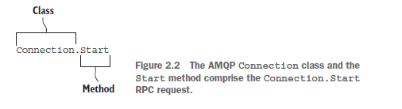

# Part 1. RabbitMQ and application architecture

## Foundational RabbitMQ

### RabbitMQ’s features and benefits

* Open source
* Platform and vendor neutral
* Lightweight
* Client libraries for most modern languages
* Flexibility in controlling messaging trade-offs
* Plugins for higher-latency environments - Because not all network topologies and architectures are the same, RabbitMQ provides for messaging in low-latency environments and plugins for higher-latency environments, such as the internet. This allows for RabbitMQ to be clustered on the same local network and share federated messages across multiple data centers.
* Layers of security

# How to speak Rabbit: the AMQ Protocol

## AMQP as an RPC transport

As an AMQP broker, RabbitMQ speaks a strict dialect for communication, utilizing a **remote procedure call (RPC)** pattern in nearly every aspect of communication with the core product.

### Kicking off the conversation

When you’re communicating with someone new in a foreign country, it’s inevitable that one of you will kick off the conversation with a greeting, something that lets you and the other person know if you’re both capable of speaking the same language. When speaking AMQP, this greeting is the protocol header, and it’s sent by the client to the server. This greeting shouldn’t be considered a request, however, as unlike the rest of the conversation that will take place, it’s not a command. RabbitMQ starts the command/response sequence by replying to the greeting with a Connection.Start command, and the client responds to the RPC request with Connection.StartOk response frame (figure 2.1).
```
Client       Server
  | ----1---->  |
  |             |
  | <----2----  |
  |             |
  | ----3---->  |
  |             |

1. Protocol header;
2. Connection.Start;
3. Connection.StartOk;

```
### Tuning in to the right channel

Similar in concept to channels on a two-way radio, the AMQP specification defines channels for communicating with RabbitMQ. Two-way radios transmit information to each other using the airwaves as the connection between them. In AMQP, channels use the negotiated AMQP connection as the conduit for transmitting information to each other, and like channels on a two-way radio, they isolate their transmissions from other conversations that are happening. **A single AMQP connection can have multiple channels, allowing multiple conversations between a client and server to take place. In technical terms, this is called multiplexing.**

## AMQP’s RPC frame structure

Very similar in concept to object-oriented programming in languages such as C++, Java, and Python, AMQP uses classes and methods, referred to as AMQP commands, to create a common language between clients and servers. The classes in AMQP define a scope of functionality, and each class contains methods that perform different tasks.
.


