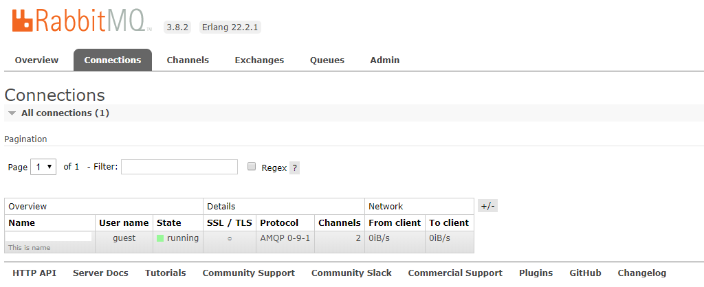
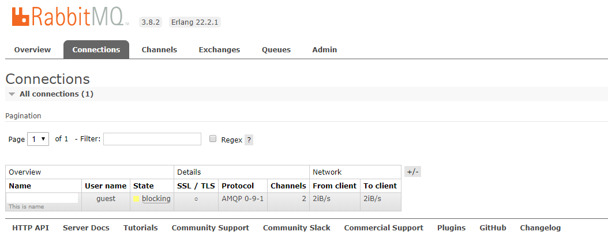

# Using Spring AMQP

## 4.1.2. Connection and Resource Management

The central component for managing a connection to the RabbitMQ broker is the ```ConnectionFactory``` interface. The responsibility of a ```ConnectionFactory``` implementation is to provide an instance of ```org.springframework.amqp.rabbit.connection.Connection```, which is a wrapper for ```com.rabbitmq.client.Connection```.

```ConnectionFactory``` implementations:
* ```CachingConnectionFactory```
* ```LocalizedQueueConnectionFactory```
* ```SimpleRoutingConnectionFactory```
* ```SingleConnectionFactory```

### CachingConnectionFactory

By default, establishes a single connection proxy that can be shared by the application. Sharing of the connection is possible since the “unit of work” for messaging with AMQP is actually a “channel”. The ```CachingConnectionFactory``` implementation supports caching of those channels, and it maintains separate caches for channels based on whether they are transactional.
However, you can configure the ```CachingConnectionFactory``` to cache connections as well as only channels. In this case, each call to createConnection() creates a new connection (or retrieves an idle one from the cache). Closing a connection returns it to the cache (if the cache size has not been reached). To cache connections, set the cacheMode to CacheMode.CONNECTION.

### It is best not to use cache mode CONNECTION.
For reason please look at [documentation:4.1.2. Connection and Resource Management](https://docs.spring.io/spring-amqp/docs/current/reference/html/).

It is important to understand that the cache size is (by default) not a limit but is merely the number of channels that can be cached. With a cache size of, say, 10, any number of channels can actually be in use. If more than 10 channels are being used and they are all returned to the cache, 10 go in the cache. The remainder are physically closed.

### You should monitor the channels in use through the RabbitMQ Admin UI and consider increasing the cache size further if you see many channels being created and closed.

**!NOTE**. Channels used within the framework (for example, RabbitTemplate) are reliably returned to the cache. If you create channels outside of the framework, (for example, by accessing the connections directly and invoking createChannel()), you must return them (by closing) reliably, perhaps in a finally block, to avoid running out of channels.

### LocalizedQueueConnectionFactory
# TODO
### SimpleRoutingConnectionFactory
# TODO
### SingleConnectionFactory 

Is available only in the unit test code of the framework. It is simpler than CachingConnectionFactory, since it does not cache channels, but it is not intended for practical usage outside of simple tests due to its lack of performance and resilience.

### Naming Connections

The connection name is displayed in the management UI if the RabbitMQ server supports it. This value does not have to be unique and cannot be used as a connection identifier — for example, in HTTP API requests. You can use a simple Lambda, as follows:
```
connectionFactory.setConnectionNameStrategy(connectionFactory -> "MY_CONNECTION");
```
An implementation of SimplePropertyValueConnectionNameStrategy sets the connection name to an application property. You can declare it as a @Bean and inject it into the connection factory, as the following example shows:
```
@Bean
public ConnectionNameStrategy cns() {
    return new SimplePropertyValueConnectionNameStrategy("spring.application.name");
}

@Bean
public ConnectionFactory rabbitConnectionFactory(ConnectionNameStrategy cns) {
    CachingConnectionFactory connectionFactory = new CachingConnectionFactory();
    ...
    connectionFactory.setConnectionNameStrategy(cns);
    return connectionFactory;
}
```

When using Spring Boot and its autoconfigured connection factory, you need only declare the ConnectionNameStrategy @Bean. Boot auto-detects the bean and wires it into the factory.

### Blocked Connections and Resource Constraints

#### Setup RabbitMQ

Start RabbitMQ container:
```
docker run --detach -p 15672:15672 -p 5672:5672 --name rabbit-instance --hostname my-rabbit rabbitmq:3-management
```
Now you can connect to RabbitMQ via http://localhost:15672. Credentials - ```guest:guest```.

#### Lower memory threshold

Join running container:
```
docker exec -it <container name> bash
```
Set memory threshold via rabbitmqctl (The default value of 0.4 stands for 40% of availalbe (detected) RAM or 40% of available virtual address space, whichever is smaller):
```
rabbitmqctl set_vm_memory_high_watermark absolute <memory_limit>
```
When using the absolute mode, it is possible to use one of the following memory units:
* M, MiB for mebibytes
* MB for megabytes
* G, GiB for gibibytes
* GB for gigabytes

Set to a small number, so RabbitMQ would not accept connections:
```
rabbitmqctl set_vm_memory_high_watermark absolute "80MB"
```
Or when the threshold or absolute limit is set to 0, it makes the memory alarm go off immediately and thus eventually blocks all publishing connections:
```
rabbitmqctl set_vm_memory_high_watermark 0
```

ConnectionFactory example. When connection is blocked it will print "Connection is blocked". When connection is unblocked it will print "Connection is unblocked":
```
@Bean
public ConnectionFactory connectionFactory() {
CachingConnectionFactory factory = new CachingConnectionFactory("localhost");
factory.setUsername("guest");
factory.setPassword("guest");
factory.setPort(5672);
factory.addConnectionListener(connection -> {
    Channel channel = connection.createChannel(false);
    channel.getConnection().addBlockedListener(new BlockedListener() {
	@Override
	public void handleBlocked(String reason) throws IOException {
	    System.out.println("Connection is blocked");
	}

	@Override
	public void handleUnblocked() throws IOException {
	    System.out.println("Connection is unblocked");
	}
    });
});
factory.setConnectionNameStrategy(cns());
return factory;
}
```

Before blocked connection:


Once the memory high watermark is set, try to connect to RabbitMQ. You will find in RabbitMQ Management Connections something like this:


And Overview page, next to Nodes will have red indication regarding memory:


However, this will not trigger connection listener. Only, if we try to publish messages, then we will get defined messages. Use the same connection factory setup in Producer code.


# TODO. Just a place holder 
## Retry

When using spring boot it is required to set properties:
```
spring.rabbitmq.listener.simple.retry.enabled=true
```

In Spring Boot, it does not work the way Spring AMQP defines:
```
@Bean
public StatefulRetryOperationsInterceptor interceptor() {
	return RetryInterceptorBuilder.stateful()
			.maxAttempts(5)
			.backOffOptions(1000, 2.0, 10000) // initialInterval, multiplier, maxInterval
			.build();
}
```

To make it work you have to:
```
spring.rabbitmq.listener.simple.retry.enabled=true
spring.rabbitmq.listener.simple.retry.max-attempts=1
```

And:
```
@Bean
public MessageRecoverer messageRecoverer(AmqpTemplate amqpTemplate) {
    return new RepublishMessageRecoverer(amqpTemplate, DEAD_EXCHANGE, DEAD_ROUTING_KEY);
}
```


https://docs.spring.io/spring-boot/docs/current/reference/htmlsingle/#boot-features-using-amqp-receiving

> By default, retries are disabled. You can also customize the RetryTemplate programmatically by declaring a RabbitRetryTemplateCustomizer bean.


--------------------------------- Simple Spring Configuration Without Spring Boot ---------------------------------

#### Producer
##### RabbitConfiguration
```
@Configuration
public class RabbitConfigurationNoBoot {

    private static final String EXCHANGE_NAME = "my-test";
    private static final String QUEUE_NAME = "my-queue";
    private static final String ROUTING_KEY = "my.key";

    @Bean
    public Exchange exchange() {
        return new TopicExchange(EXCHANGE_NAME, true, false);
    }

    @Bean
    public Queue queue() {
        return new Queue(QUEUE_NAME, true, false, false);
    }

    @Bean
    public Binding bindQueueToExchange() {
        return BindingBuilder
                .bind(queue())
                .to(exchange())
                .with(ROUTING_KEY)
                .noargs();
    }

    @Bean
    public ConnectionFactory connectionFactory() {
        CachingConnectionFactory factory = new CachingConnectionFactory("localhost");
        factory.setUsername("guest");
        factory.setPassword("guest");
        factory.setPort(5672);
        return factory;
    }

    @Bean
    public AmqpTemplate rabbitTemplate() {
        RabbitTemplate template = new RabbitTemplate();
        template.setConnectionFactory(connectionFactory());
        template.setExchange(EXCHANGE_NAME);
        template.setRoutingKey(ROUTING_KEY);
        return template;
    }

    /**
     * The admin declares all elements (Queue, Exchange, Bindings) when a connection is first opened.
     */
    @Bean
    public AmqpAdmin amqpAdmin() {
        return new RabbitAdmin(connectionFactory());
    }
}
```


##### Main
```
public class DemoApplication {

    public static void main(String[] args) {
        AnnotationConfigApplicationContext context = new AnnotationConfigApplicationContext();
        context.register(RabbitConfigurationNoBoot.class);
        context.refresh();
        AmqpTemplate rabbitTemplate = context.getBean("rabbitTemplate", AmqpTemplate.class);
        rabbitTemplate.convertAndSend("Hello");
    }
}
```


#### Consumer with RabbitTemplate
##### RabbitConfiguration
```
@Configuration
public class RabbitConfigurationNoBoot {

    private static final String EXCHANGE_NAME = "my-test";
    private static final String QUEUE_NAME = "my-queue";
    private static final String ROUTING_KEY = "my.key";

    @Bean
    public Exchange exchange() {
        return new TopicExchange(EXCHANGE_NAME, true, false);
    }

    @Bean
    public Queue queue() {
        return new Queue(QUEUE_NAME, true, false, false);
    }

    @Bean
    public Binding bindQueueToExchange() {
        return BindingBuilder
                .bind(queue())
                .to(exchange())
                .with(ROUTING_KEY)
                .noargs();
    }

    @Bean
    public ConnectionFactory connectionFactory() {
        CachingConnectionFactory factory = new CachingConnectionFactory("localhost");
        factory.setUsername("guest");
        factory.setPassword("guest");
        factory.setPort(5672);
        return factory;
    }

    @Bean
    public RabbitTemplate rabbitTemplate() {
        RabbitTemplate template = new RabbitTemplate();
        template.setConnectionFactory(connectionFactory());
        template.setExchange(EXCHANGE_NAME);
        template.setRoutingKey(ROUTING_KEY);
        return template;
    }

    @Bean
    public ConsumerNoBoot consumerNoBoot(RabbitTemplate template) {
        return new ConsumerNoBoot(template, QUEUE_NAME);
    }
    
     /**
     * The admin declares all elements (Queue, Exchange, Bindings) when a connection is first opened.
     */
    @Bean
    public AmqpAdmin amqpAdmin() {
        return new RabbitAdmin(connectionFactory());
    }
}
```
##### Consumer
```
public class ConsumerNoBoot {

    private final RabbitTemplate template;
    private final String queueName;

    public ConsumerNoBoot(RabbitTemplate template, String queueName) {
        this.template = template;
        this.queueName = queueName;
    }

    public void consume() {
        Message receive = template.receive(queueName);
        System.out.println(receive);
    }
}
```
##### Main
```
public class DemoApplication {

    public static void main(String[] args) {
        AnnotationConfigApplicationContext context = new AnnotationConfigApplicationContext();
        context.register(RabbitConfigurationNoBoot.class);
        context.refresh();
        ConsumerNoBoot consumer = context.getBean("consumerNoBoot", ConsumerNoBoot.class);
        consumer.consume();
    }
}
```

#### Asynchronous Consumer
##### RabbitConfiguration

```
@Configuration
public class RabbitConfigurationNoBoot {

    private static final String EXCHANGE_NAME = "my-test";
    private static final String QUEUE_NAME = "my-queue";
    private static final String ROUTING_KEY = "my.key";

    @Bean
    public Exchange exchange() {
        return new TopicExchange(EXCHANGE_NAME, true, false);
    }

    @Bean
    public Queue queue() {
        return new Queue(QUEUE_NAME, true, false, false);
    }

    @Bean
    public Binding bindQueueToExchange() {
        return BindingBuilder
                .bind(queue())
                .to(exchange())
                .with(ROUTING_KEY)
                .noargs();
    }

    @Bean
    public ConnectionFactory connectionFactory() {
        CachingConnectionFactory factory = new CachingConnectionFactory("localhost");
        factory.setUsername("guest");
        factory.setPassword("guest");
        factory.setPort(5672);
        return factory;
    }

    @Bean
    public SimpleMessageListenerContainer simpleMessageListenerContainer() {
        SimpleMessageListenerContainer container = new SimpleMessageListenerContainer();
        container.setConnectionFactory(connectionFactory());
        container.setQueueNames(QUEUE_NAME);
        container.setMessageListener(new ConsumerNoBoot());
        return container;
    }

    /**
     * The admin declares all elements (Queue, Exchange, Bindings) when a connection is first opened.
     */
    @Bean
    public AmqpAdmin amqpAdmin() {
        return new RabbitAdmin(connectionFactory());
    }
}
```

##### Consumer
```
public class ConsumerNoBoot implements MessageListener {

    @Override
    public void onMessage(Message message) {
        System.out.println(message);
    }
}
```

#### Asynchronous Consumer with manual ack
##### RabbitConfiguration
```
@Configuration
public class RabbitConfigurationNoBoot {

    private static final String EXCHANGE_NAME = "my-test";
    private static final String QUEUE_NAME = "my-queue";
    private static final String ROUTING_KEY = "my.key";

    @Bean
    public Exchange exchange() {
        return new TopicExchange(EXCHANGE_NAME, true, false);
    }

    @Bean
    public Queue queue() {
        return new Queue(QUEUE_NAME, true, false, false);
    }

    @Bean
    public Binding bindQueueToExchange() {
        return BindingBuilder
                .bind(queue())
                .to(exchange())
                .with(ROUTING_KEY)
                .noargs();
    }

    @Bean
    public ConnectionFactory connectionFactory() {
        CachingConnectionFactory factory = new CachingConnectionFactory("localhost");
        factory.setUsername("guest");
        factory.setPassword("guest");
        factory.setPort(5672);
        return factory;
    }

    @Bean
    public SimpleMessageListenerContainer simpleMessageListenerContainer() {
        SimpleMessageListenerContainer container = new SimpleMessageListenerContainer();
        container.setConnectionFactory(connectionFactory());
        container.setQueueNames(QUEUE_NAME);
        container.setMessageListener(new ConsumerNoBoot());
        container.setAcknowledgeMode(AcknowledgeMode.MANUAL);
        return container;
    }

    /**
     * The admin declares all elements (Queue, Exchange, Bindings) when a connection is first opened.
     */
    @Bean
    public AmqpAdmin amqpAdmin() {
        return new RabbitAdmin(connectionFactory());
    }
}
```
##### Consumer
```
public class ConsumerNoBoot implements ChannelAwareMessageListener {

    @Override
    public void onMessage(Message message, Channel channel) throws Exception {
        System.out.println("Message received");
        long deliveryTag = message.getMessageProperties().getDeliveryTag();
        channel.basicAck(deliveryTag, false);
    }
}
```


----------------------------- Publisher Returns -----------------------------
```
@Bean
    public ConnectionFactory connectionFactory() {
        CachingConnectionFactory factory = new CachingConnectionFactory("localhost");
        factory.setUsername("guest");
        factory.setPassword("guest");
        factory.setPort(5672);
        factory.setPublisherReturns(true);
        return factory;
    }

    @Bean
    public AmqpTemplate rabbitTemplate() {
        RabbitTemplate template = new RabbitTemplate();
        template.setConnectionFactory(connectionFactory());
        template.setExchange(EXCHANGE_NAME);
        template.setRoutingKey(ROUTING_KEY + "Bad");
        template.setMandatory(true);
        template.setReturnCallback((message, replyCode, replyText, exchange, routingKey) ->
                        System.out.println("Message was returned"));
        return template;
    }
```


